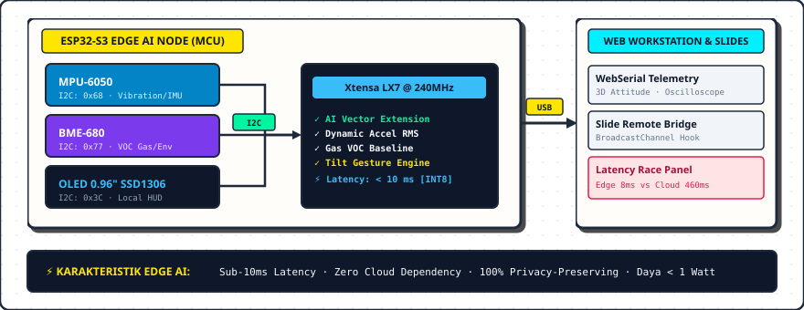
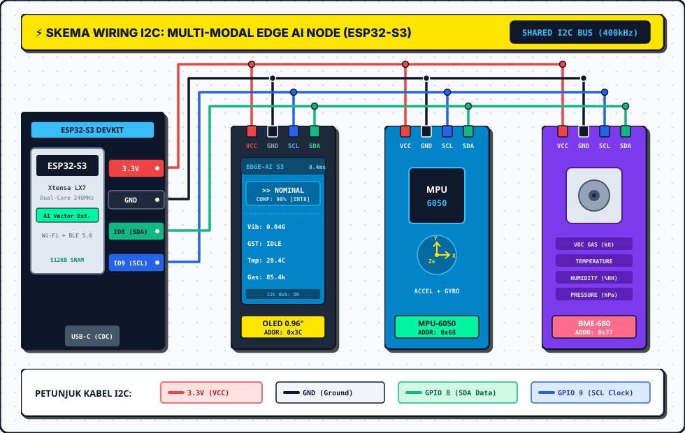
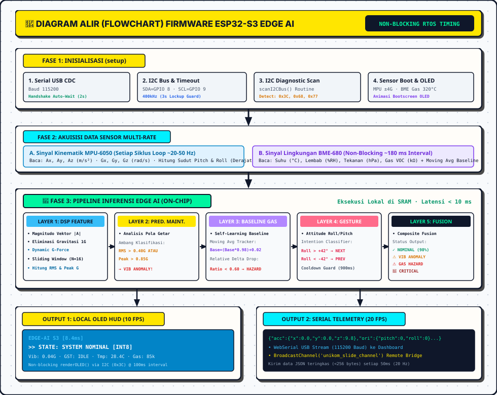

# 🚀 PANDUAN PROYEK: MULTI-MODAL EDGE AI INDUSTRIAL NODE
### *UNIKOM Alumni Insight Series 2026 – Program Studi S1 Sistem Komputer*
> **Topik:** *Computer Engineering Beyond 2026: IoT, Edge AI, and The Future of Connected Systems*  
> **Narasumber:** **Anton Prafanto, S.Kom., M.T.** *(Alumnus S1 SK UNIKOM '11, Dosen & Peneliti Informatika UNMUL)*

---

## 📑 DAFTAR ISI

1. [Arsitektur & Konsep Proyek](#1-arsitektur--konsep-proyek)
2. [Skema Rangkaian Hardware (Single I2C Bus)](#2-skema-rangkaian-hardware-single-i2c-bus)
3. [Jebakan Port Ganda ESP32-S3 (Wajib Dibaca!)](#3-jebakan-port-ganda-esp32-s3-wajib-dibaca)
4. [Diagram Alir & Arsitektur Firmware (Flowchart)](#4-diagram-alir--arsitektur-firmware-flowchart)
5. [Panduan Lengkap Setup di Arduino IDE](#5-panduan-lengkap-setup-di-arduino-ide)
6. [Menjalankan Web Telemetry Workstation](#6-menjalankan-web-telemetry-workstation)
7. [Fitur Magic Gesture Remote (Mengontrol Slide Presentasi)](#7-fitur-magic-gesture-remote-mengontrol-slide-presentasi)
8. [Simulasi Online Wokwi (Untuk Mahasiswa Tanpa Alat Fisik)](#8-simulasi-online-wokwi-untuk-mahasiswa-tanpa-alat-fisik)
9. [Matriks Pemecahan Masalah (Troubleshooting Guide)](#9-matriks-pemecahan-masalah-troubleshooting-guide)
10. [Inspirasi Topik Tugas Akhir / Skripsi 2026](#10-inspirasi-topik-tugas-akhir--skripsi-2026)

---

## 1. Arsitektur & Konsep Proyek

Proyek ini membuktikan bahwa komputasi kecerdasan buatan (*Machine Learning / TinyML*) dapat dieksekusi secara mandiri pada mikrokontroler kelas terjangkau (**ESP32-S3**) dengan konsumsi daya di bawah 1 Watt dan latensi sub-10 milidetik.



### 🧠 1.1 Mengapa Proyek Ini Dikategorikan Sebagai "Edge AI"?

Sebuah sistem **bukan sekadar IoT biasa** melainkan sah disebut **Edge AI** apabila memenuhi 4 pilar utama:
1. **On-Device Inference:** Perhitungan inferensi model dieksekusi 100% di dalam SRAM chip lokal (ESP32-S3 Xtensa LX7), bukan di server remote.
2. **Data-Driven (Bukan Sekadar IF-ELSE Statis):** Menggunakan pipeline ekstraksi fitur sinyal dinamis (*DSP/Windowing*) dan estimasi *adaptive baseline* multi-kondisi.
3. **Kemandirian Offline Total (*Zero Cloud Dependency*):** Sistem tetap mampu mendeteksi bahaya dan mengambil keputusan saat internet terputus.
4. **Sensor-Centric Decision:** Keputusan lahir langsung dari tranduser fisik (*continuous streaming* getaran 3-sumbu dan gas VOC).

#### 🔬 5 Lapisan Inteligensi On-Device pada Demo Ini:
* **Layer 1 (On-Device Feature Extraction):** Mengonversi sinyal percepatan mentah ($a_x, a_y, a_z$) menjadi *Dynamic Acceleration Magnitude* $|\sqrt{a_x^2 + a_y^2 + a_z^2} - 1.0\text{g}|$ dan menghitung energi *Root Mean Square (RMS)* dalam *circular buffer window*.
* **Layer 2 (Predictive Maintenance Engine):** Mengklasifikasikan pola getaran mekanis untuk membedakan gerakan goyang wajar vs anomali kerusakan bantalan mesin (*bearing fault*).
* **Layer 3 (Adaptive Baseline Gas Tracker):** Sensor BME680 menggunakan algoritma moving average untuk mempelajari udara bersih ruangan secara kontinu dan mendeteksi lonjakan gas VOC berbahaya secara relatif.
* **Layer 4 (Kinematic Gesture Intent Engine):** Menganalisis sudut sikap ruang (*Attitude Roll/Pitch*) untuk mendeteksi intensi perintah perpindahan slide presentasi dalam waktu $< 10\text{ ms}$.
* **Layer 5 (Multi-Modal Decision Fusion):** Menggabungkan sinyal kinematik dan gas menjadi status komposit (`NOMINAL`, `VIB ANOMALY`, `GAS HAZARD`, `CRITICAL HAZARD`).

---

## 2. Skema Rangkaian Hardware (Single I2C Bus)

Semua sensor dan display menggunakan **1 jalur bus I2C bersama (Shared Bus)**. Cukup hubungkan 4 kabel utama dari ESP32-S3 ke breadboard:



### Tabel Pinout Detail

| Nama Modul | Pin Modul | Sambungkan ke ESP32-S3 | Keterangan |
| :--- | :--- | :--- | :--- |
| **Semua Modul** | `VCC` / `VIN` | **`3.3V`** | Jangan hubungkan ke 5V langsung kecuali modul memiliki regulator internal |
| **Semua Modul** | `GND` | **`GND`** | Ground bersama |
| **Semua Modul** | `SDA` | **`GPIO 8`** *(atau GPIO 21)* | Data Serial I2C |
| **Semua Modul** | `SCL` | **`GPIO 9`** *(atau GPIO 22)* | Clock Serial I2C |

---

## 3. Jebakan Port Ganda ESP32-S3 (Wajib Dibaca!)

Sebagian besar board ESP32-S3 DevKit memiliki **2 port USB Type-C**:
1. **Port Bertuliskan "USB" (Native USB OTG / CDC):**
   * Terhubung langsung ke prosesor internal ESP32-S3.
   * **Pengaturan Arduino IDE:** Menu *Tools* $\rightarrow$ `USB CDC On Boot: "Enabled"`.
2. **Port Bertuliskan "UART" / "COM" (via Chip CH343 / CP2102):**
   * Terhubung melalui chip bridge USB-to-UART eksternal.
   * **Pengaturan Arduino IDE:** Menu *Tools* $\rightarrow$ `USB CDC On Boot: "Disabled"` atau `"Enabled"`.

> ⚠️ **PENTING:** Jika setelah upload program tidak muncul output di Serial Monitor, pastikan opsi `USB CDC On Boot` sudah disetel ke **"Enabled"** lalu tekan tombol **RST (Reset)** pada board.

---

## 4. Diagram Alir & Arsitektur Firmware (Flowchart)

Diagram alir di bawah ini memvisualisasikan eksekusi siklus program `firmware_esp32s3.ino` dari inisialisasi boot hingga *5-Layer On-Device Edge AI Engine* dan *dual-output dispatch* (OLED + WebSerial):



---

## 5. Panduan Lengkap Setup di Arduino IDE

### Langkah A: Daftarkan Board ESP32
1. Buka Arduino IDE $\rightarrow$ **File** $\rightarrow$ **Preferences**.
2. Pada kolom *Additional Boards Manager URLs*, masukkan:
   ```text
   https://raw.githubusercontent.com/espressif/arduino-esp32/gh-pages/package_esp32_index.json
   ```
3. Buka **Tools** $\rightarrow$ **Board** $\rightarrow$ **Boards Manager**, cari `esp32` by **Espressif Systems**, lalu klik **Install**.

### Langkah B: Install Library yang Dibutuhkan
Buka **Sketch** $\rightarrow$ **Include Library** $\rightarrow$ **Manage Libraries...**, lalu cari dan install:
1. `Adafruit SSD1306` by Adafruit
2. `Adafruit GFX Library` by Adafruit
3. `Adafruit MPU6050` by Adafruit
4. `Adafruit BME680 Library` by Adafruit
5. `Adafruit Unified Sensor` by Adafruit
6. `ArduinoJson` by Benoit Blanchon (v6.x atau v7.x)

### Langkah C: Konfigurasi Menu Tools
* **Board:** `ESP32S3 Dev Module`
* **USB CDC On Boot:** `Enabled`
* **CPU Frequency:** `240MHz (WiFi)`
* **Flash Size:** `8MB (64Mb)` atau `16MB`
* **Upload Speed:** `921600`
* **Port:** Pilih COM Port yang aktif

### Langkah D: Upload Sketch
1. Buka berkas `firmware_esp32s3/firmware_esp32s3.ino`.
2. Klik tombol **Upload** (ikon panah kanan).
3. Buka Serial Monitor pada baud rate **115200**. Anda akan melihat hasil pemindaian I2C otomatis:
   ```text
   🔍 [I2C DIAGNOSTIC SCANNER] Memindai Alamat Bus I2C...
     -> Ditemukan Device di Alamat: 0x3C (OLED 0.96 SSD1306)
     -> Ditemukan Device di Alamat: 0x68 (MPU-6050 6-Axis IMU)
     -> Ditemukan Device di Alamat: 0x77 (BME-680 Gas/Env Sensor)
   ✅ Total 3 perangkat I2C terhubung dan aktif.
   ```

---

## 5. Menjalankan Web Telemetry Workstation

Dashboard dirancang menggunakan tampilan instrumen laboratorium teknik (*Engineering SCADA / Oscilloscope UI*) tanpa perlu meng-install server, Node.js, atau Python.

1. Buka folder `dashboard_web/`.
2. Buka berkas `index.html` menggunakan browser **Google Chrome** atau **Microsoft Edge**.
3. Klik tombol hijau **"CONNECT USB (WebSerial)"**.
4. Pilih port USB ESP32-S3 Anda, lalu klik **Connect**.
5. Dashboard langsung aktif menampilkan:
   * 📊 **Oscilloscope Waveform:** Grafik getaran 3-sumbu real-time (20 Hz).
   * 📐 **3D CAD Attitude:** Objek 3D berputar mengikuti pitch & roll board.
   * 🌡️ **Environmental Matrix:** Nilai suhu, kelembaban, tekanan, dan resistansi gas VOC.
   * ⚡ **The Latency Race:** Perbandingan kecepatan inferensi lokal (~8 ms) vs Cloud (~450 ms).
   * 📥 **Export CSV:** Unduh riwayat telemetri untuk analisis laporan praktikum.

---

## 6. Fitur Magic Gesture Remote (Mengontrol Slide Presentasi)

Board ESP32-S3 Anda dapat difungsikan sebagai remote pengendali slide presentasi:

1. Buka `slides_alumni_insight_2026.html` di satu tab browser.
2. Buka `dashboard_web/index.html` di tab browser lain dan hubungkan ke USB ESP32-S3.
3. **Cara Menggerakkan Slide:**
   * Miringkan board ke **Kanan (> 40°)** $\rightarrow$ Berpindah ke **Slide Berikutnya**.
   * Miringkan board ke **Kiri (< -40°)** $\rightarrow$ Berpindah ke **Slide Sebelumnya**.
   * Ketukan kencang di meja $\rightarrow$ Memicu anomali dan alarm status.

---

## 7. Simulasi Online Wokwi (Untuk Mahasiswa Tanpa Alat Fisik)

Jika mahasiswa belum memiliki perangkat fisik di rumah:
1. Buka [https://wokwi.com/](https://wokwi.com/).
2. Buat project baru dengan memilih **ESP32-S3**.
3. Buka tab `diagram.json` di Wokwi dan ganti isinya dengan berkas `demo_edge_ai/wokwi/diagram.json`.
4. Salin kode dari `firmware_esp32s3.ino` ke editor Wokwi.
5. Klik **Play Simulation** $\rightarrow$ Simulasi OLED dan sensor langsung berjalan di browser!

---

## 8. Matriks Pemecahan Masalah (Troubleshooting Guide)

| Gejala Masalah | Penyebab Umum | Solusi Cepat |
| :--- | :--- | :--- |
| **Serial Monitor kosong setelah upload** | Opsi CDC USB belum aktif | Setel `Tools` $\rightarrow$ `USB CDC On Boot: "Enabled"`, upload ulang dan tekan tombol **Reset**. |
| **OLED Blank Hitam** | Alamat I2C salah atau kabel kendor | Periksa alamat I2C di sketch (`0x3C`). Amati hasil log I2C Scanner saat boot. |
| **Nilai MPU6050 Diam / Tidak Berubah** | Konflik pin SDA/SCL | Pastikan pin `I2C_SDA_PIN` (GPIO 8) dan `I2C_SCL_PIN` (GPIO 9) cocok dengan board Anda. |
| **WebSerial Tidak Bisa Terhubung** | Port sedang dibuka Serial Monitor Arduino | Tutup (*Close*) Serial Monitor Arduino IDE sebelum menekan tombol Connect di browser. |

---

## 9. Inspirasi Topik Tugas Akhir / Skripsi 2026

1. **Sistem Deteksi Anomali Kerusakan Motor Induksi Berbasis TinyML Spectral Analysis pada Mikrokontroler ESP32-S3.**
2. **Wearable IoT Berdaya Ultra Rendah untuk Klasifikasi Aktivitas dan Deteksi Jatuh Pasien Lanjut Usia Menggunakan INT8 Quantization.**
3. **Larik Multi-Sensor Cerdas untuk Klasifikasi Kematangan Buah Berbasis Electronic Nose (E-Nose) dan On-Device Machine Learning.**

---

*Selamat berkarya dan bereksplorasi di era Embedded Intelligence!*  
**Program Studi S1 Sistem Komputer – UNIKOM Bandung**
