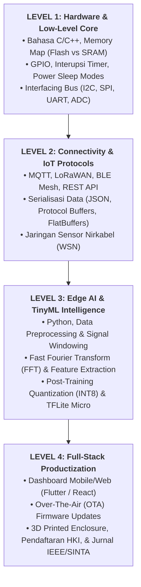

# 📘 MASTER HANDOUT & STARTER KIT MAHASISWA
## Menjadi Inovator Edge AI & Embedded Intelligence (Beyond 2026)

* **Program:** Alumni Insight Series 2026 – Program Studi Sistem Komputer UNIKOM
* **Topik:** *Computer Engineering Beyond 2026: IoT, Edge AI, and The Future of Connected Systems*
* **Narasumber:** Anton Prafanto, S.Kom., M.T. (Alumnus S1 Sistem Komputer UNIKOM, S2 STEI ITB, Dosen & Peneliti Informatika UNMUL)
* **Kanal Portofolio:** [GitHub: github.com/antonprafanto](https://github.com/antonprafanto) | [Email: antonprafanto@unmul.ac.id](mailto:antonprafanto@unmul.ac.id)

---

## DAFTAR ISI HANDOUT

1. [Peta Jalan 4 Level: Mahasiswa Menuju Edge AI Engineer](#1-peta-jalan-4-level-mahasiswa-menuju-edge-ai-engineer)
2. [Kamus Konsep Inti: Dari Mikrokontroler hingga Neural Network](#2-kamus-konsep-inti-dari-mikrokontroler-hingga-neural-network)
3. [Panduan Belanja Hardware & Sensor Terjangkau (< Rp 200.000)](#3-panduan-belanja-hardware--sensor-terjangkau--rp-200000)
4. [Tutorial Praktis 15 Menit: Proyek Pertama TinyML (Tanpa Alat Fisik / Menggunakan Wokwi & Edge Impulse)](#4-tutorial-praktis-15-menit-proyek-pertama-tinyml-tanpa-alat-fisik--menggunakan-wokwi--edge-impulse)
5. [Arsitektur Kode Starter: C++ On-Device Inference di ESP32](#5-arsitektur-kode-starter-c-on-device-inference-di-esp32)
6. [Kumpulan Dataset & Simulasi Siap Pakai](#6-kumpulan-dataset--simulasi-siap-pakai)
7. [Panduan Mengatasi Masalah (Troubleshooting & Debugging)](#7-panduan-mengatasi-masalah-troubleshooting--debugging)
8. [Matriks Transformasi Ide Skripsi & Panduan Menembus Publikasi/HKI](#8-matriks-transformasi-ide-skripsi--panduan-menembus-publikasihki)
9. [Daftar Repositori & Kursus Gratis Berstandar Internasional](#9-daftar-repositori--kursus-gratis-berstandar-internasional)

---

## 1. PETA JALAN 4 LEVEL: MAHASISWA MENUJU EDGE AI ENGINEER



---

## 2. KAMUS KONSEP INTI: DARI MIKROKONTROLER HINGGA NEURAL NETWORK

* **Edge AI:** Penerapan algoritma kecerdasan buatan (Machine Learning / Deep Learning) yang dieksekusi langsung pada perangkat komputasi lokal di ujung jaringan (*edge*), bukan di server terpusat (*cloud*).
* **TinyML (Tiny Machine Learning):** Cabang keilmuan yang memungkinkan model Machine Learning berjalan pada perangkat keras berdaya sangat rendah (mikrokontroler) dengan konsumsi daya di bawah 1 miliwatt dan memori hanya puluhan kilobyte.
* **Post-Training Quantization (PTQ):** Proses kompresi model AI dengan cara mengubah format representasi bobot matematis dari `Float32` (pecahan 32-bit) menjadi `Int8` (bilangan bulat 8-bit). Hasilnya: ukuran model menyusut hingga **75%**, eksekusi CPU **4x lebih cepat**, dengan akurasi nyaris tanpa penurunan (< 1–2%).
* **Tensor Arena:** Area memori di dalam RAM (SRAM) internal mikrokontroler yang dialokasikan khusus untuk menyimpan tensor input, tensor output, dan layer perantara (*scratchpad memory*) selama proses inferensi berlangsung.
* **Inference vs Training:**
  * *Training:* Proses komputasi berat melatih model menggunakan ribuan sampel data (dilakukan di PC / Google Colab / GPU).
  * *Inference:* Proses mengeksekusi model yang sudah jadi untuk menebak input baru (dilakukan di mikrokontroler).
* **Fast Fourier Transform (FFT):** Algoritma untuk mengubah sinyal domain waktu (misal: getaran accelerometer atau gelombang audio) menjadi domain frekuensi, sangat krusial untuk fitur AI deteksi kerusakan mesin atau suara.

---

## 3. PANDUAN BELANJA HARDWARE & SENSOR TERJANGKAU (< RP 200.000)

Untuk mahasiswa Sistem Komputer, berikut daftar komponen yang sangat direkomendasikan dan mudah dibeli di marketplace Indonesia:

### A. Board Mikrokontroler Rekomendasi
1. **ESP32-S3 DevKit (N8R8 / N16R8):**
   * *Fitur:* Dual-core 240 MHz Xtensa LX7, instruksi vektor akselerasi AI, Wi-Fi 2.4 GHz, BLE 5.0, 8MB Flash, 8MB PSRAM.
   * *Harga Estimasi:* Rp 80.000 – Rp 120.000.
   * *Cocok Untuk:* Voice recognition, TinyML computer vision (dengan modul kamera OV2640), gateway IoT.
2. **Raspberry Pi Pico 2 / RP2350:**
   * *Fitur:* Dual ARM Cortex-M33 / Hazard3 RISC-V 150 MHz, ultra low-power sleep mode.
   * *Harga Estimasi:* Rp 80.000 – Rp 95.000.
   * *Cocok Untuk:* Proyek TinyML baterai koin beroperasi berbulan-bulan (wearable / sensor getaran).
3. **STM32F401 / F411 ("BlackPill"):**
   * *Fitur:* ARM Cortex-M4 dengan FPU hardware, support toolchain industri ST Edge AI.
   * *Harga Estimasi:* Rp 55.000 – Rp 75.000.

### B. Sensor Penunjang TinyML
* **IMU 6-Axis (MPU-6050 / LSM6DS3):** Deteksi getaran mesin industri, gestur tangan, anomali jatuh (~Rp 25.000).
* **I2S Digital Microphone (INMP441):** Deteksi kata kunci suara (*wake-word*), deteksi batuk ternak, anomali suara bantalan mesin (~Rp 18.000).
* **Camera Module (OV2640 2MP):** Klasifikasi hama, pembacaan meteran analog, deteksi objek sederhana (~Rp 35.000).
* **Environmental Sensor (BME280 / DHT22):** Suhu, kelembaban, dan tekanan udara presisi (~Rp 30.000 – Rp 50.000).
* **Transceiver LoRa (SX1276 / RFM95 915MHz):** Pengiriman sinyal jarak jauh hingga 5–10 km tanpa pulsa/internet (~Rp 85.000).

---

## 4. TUTORIAL PRAKTIS 15 MENIT: PROYEK PERTAMA TINYML
### (Deteksi Anomali Gerakan Menggunakan Edge Impulse & Wokwi Tanpa Perlu Beli Alat)

Jika kalian belum memiliki alat fisik, ikuti langkah hands-on gratis ini:

```
[Langkah 1: Buka edgeimpulse.com & Buat Akun Gratis]
   ↓
[Langkah 2: Data Acquisition via Smartphone Sensor]
   • Scan QR Code Edge Impulse dari HP kalian.
   • Rekam 2 kelas gerakan: "Gerakan Normal (Jalan)" vs "Gerakan Anomali (Jatuh/Guncangan Keras)".
   • Rekam masing-masing 50 sampel (durasi per sampel 2 detik).
   ↓
[Langkah 3: Create Impulse (Desain Pipeline)]
   • Input: Time series data (3-axis accelerometer).
   • Processing Block: Spectral Analysis (FFT filter).
   • Learning Block: Classification (Keras Neural Network).
   ↓
[Langkah 4: Model Training & INT8 Quantization]
   • Klik "Start Training".
   • Evaluasi Confusion Matrix (Target Akurasi > 90%).
   • Edge Impulse otomatis melakukan Quantization ke INT8.
   ↓
[Langkah 5: Export Library ke C++ / Arduino]
   • Pilih menu "Deployment" → Pilih "Arduino Library" atau "C++ Library".
   • Unduh file .ZIP library.
   ↓
[Langkah 6: Uji di Simulator Wokwi (wokwi.com)]
   • Buat proyek ESP32 di Wokwi.com.
   • Tambahkan library Edge Impulse ke Wokwi.
   • Jalankan simulasi inferensi dan amati output serial monitor!
```

---

## 5. ARSITEKTUR KODE STARTER: C++ ON-DEVICE INFERENCE DI ESP32

Salin dan pelajari pola kode berikut untuk mengintegrasikan model TinyML ke dalam *firmware* mikrokontroler:

```cpp
/**
 * Starter Code: On-Device TinyML Inference pada ESP32
 * Penulis: Anton Prafanto, S.Kom., M.T. (UNIKOM Alumni Insight)
 */

#include <Wire.h>
#include <MPU6050.h> // Library sensor akselerometer
#include "my_tinyml_model_inferencing.h" // Library hasil export Edge Impulse

MPU6050 mpu;

// Buffer untuk menampung data sensor mentah (Windowing)
float sensor_buffer[EI_CLASSIFIER_DSP_INPUT_FRAME_SIZE];

void setup() {
    Serial.begin(115200);
    Wire.begin();
    mpu.initialize();

    if (!mpu.testConnection()) {
        Serial.println("❌ Sensor MPU6050 tidak terdeteksi!");
        while(1);
    }
    Serial.println("✅ Sensor MPU6050 siap. Model TinyML Aktif.");
}

void loop() {
    // 1. Akuisisi data sensor sesuai frekuensi sampling model (misal: 50 Hz)
    for (size_t i = 0; i < EI_CLASSIFIER_DSP_INPUT_FRAME_SIZE; i += 3) {
        int16_t ax, ay, az;
        mpu.getAcceleration(&ax, &ay, &az);

        // Normalisasi sinyal (konversi ke satuan m/s^2)
        sensor_buffer[i]     = (float)ax / 16384.0f * 9.81f;
        sensor_buffer[i + 1] = (float)ay / 16384.0f * 9.81f;
        sensor_buffer[i + 2] = (float)az / 16384.0f * 9.81f;

        delay(20); // 50 Hz sampling rate (1000ms / 50 = 20ms)
    }

    // 2. Bungkus buffer ke dalam struktur sinyal Edge Impulse
    signal_t signal;
    int err = numpy::signal_from_buffer(sensor_buffer, EI_CLASSIFIER_DSP_INPUT_FRAME_SIZE, &signal);
    if (err != 0) {
        Serial.println("Gagal membungkus sinyal buffer!");
        return;
    }

    // 3. Jalankan inferensi on-device (hanya memakan waktu ~10-15 milidetik)
    ei_impulse_result_t result = { 0 };
    err = run_classifier(&signal, &result, false);
    if (err != EI_IMPULSE_OK) {
        Serial.println("Inferensi gagal!");
        return;
    }

    // 4. Analisis hasil klasifikasi probabilitas
    Serial.println("--- HASIL INFERENSI LOKAL ---");
    for (size_t ix = 0; ix < EI_CLASSIFIER_LABEL_COUNT; ix++) {
        Serial.print(result.classification[ix].label);
        Serial.print(": ");
        Serial.println(result.classification[ix].value, 4);
    }

    // 5. Logika Aksi / Aktuator Lokal Mandiri
    if (result.classification[1].value > 0.85f) { // Jika kelas 'ANOMALI' > 85%
        Serial.println("⚠️ BAHAYA: Kerusakan / Anomali Terdeteksi! Memicu Alarm.");
        // Jalankan relay, buzzer, atau kirim data darurat via LoRa
    }
}
```

---

## 6. KUMPULAN DATASET & SIMULASI SIAP PAKAI

Untuk melatih model AI sebelum dipasang ke alat, gunakan dataset publik gratis berikut:

1. **NASA Bearing Dataset (Vibration):** Data getaran bearing rusak vs sehat untuk *Predictive Maintenance*. ([Kaggle Dataset](https://www.kaggle.com/datasets/vinayak123tyagi/bearing-dataset))
2. **Speech Commands Dataset (Google):** 65.000 file audio kata pendek 1 detik (*"yes", "no", "up", "down"*) untuk *Keyword Spotting*.
3. **Cattle / Poultry Audio Dataset:** Kumpulan suara rekaman ayam dan ternak untuk mendeteksi batuk penyakit pernapasan.
4. **Wokwi TinyML Simulation Samples:** Simulasi proyek ESP32 + TinyML yang bisa dijalankan langsung di browser: [wokwi.com](https://wokwi.com).

---

## 7. PANDUAN MENGATASI MASALAH (TROUBLESHOOTING & DEBUGGING)

| Gejala Masalah | Penyebab Utama | Solusi Praktis |
| :--- | :--- | :--- |
| **Error: `AllocateTensors() failed` / Out of Memory** | Ukuran `tensor_arena` di RAM mikrokontroler terlalu kecil untuk menampung layer model. | Perbesar nilai `kTensorArenaSize` (misal dari 10KB ke 25KB), atau kurangi resolusi input / ukuran filter pada model. |
| **Akurasi di PC 95%, tapi di ESP32 salah terus** | Perbedaan frekuensi sampling (*Sampling Rate Mismatch*) antara saat merekam data latihan dengan pembacaan sensor nyata. | Pastikan `delay()` di mikrokontroler presisi menggunakan hardware timer interrupt (`ticker.h`), bukan `delay()` biasa. |
| **Mikrokontroler mendadak Restart / Crash (Brownout)** | Sensor menarik arus puncak (*current spike*) sesaat, menyebabkan tegangan 3.3V drop. | Pasang kapasitor decoupling `100 µF` (elektrolit) dan `0.1 µF` (keramik) di antara pin `VCC` dan `GND` sensor. |
| **Baterai Cepat Habis (< 2 hari)** | Mikrokontroler tetap berada di mode aktif dan radio Wi-Fi terus menyala. | Gunakan **Deep Sleep Mode** (`esp_deep_sleep_start()`) dan hidupkan ESP32 hanya saat ada interupsi getaran (`ext0 wake-up`). |

---

## 8. MATRIKS TRANSFORMASI IDE SKRIPSI & PANDUAN PUBLIKASI / HKI

### A. Transformasi Judul Tugas Akhir Menuju Standar 2026

```
❌ HINDARI JUDUL MONOTON (STANDAR LAMA):
"Sistem Monitoring Suhu dan Kelembaban Ruangan Berbasis Arduino dan Aplikasi Blynk"

✅ UBAH MENJADI JUDUL REKAYASA BERNILAI TINGGI:
"Rancang Bangun Edge Node Pendeteksi Anomali Mikroklimat Termal Menggunakan TinyML pada Mikrokontroler ESP32-S3"
--------------------------------------------------------------------------------
❌ HINDARI:
"Alat Pendeteksi Kebocoran Gas Menggunakan Sensor MQ-2 dan Notifikasi SMS"

✅ UBAH MENJADI:
"Sistem Klasifikasi Pola Gas Beracun dan Prediksi Titik Sumber Kebocoran Berbasis Wireless Sensor Network dan Fuzzy/Edge AI"
--------------------------------------------------------------------------------
❌ HINDARI:
"Monitoring Getaran Motor Listrik via Website"

✅ UBAH MENJADI:
"Implementasi Fast Fourier Transform (FFT) dan Autoencoder TinyML pada ESP32 untuk Predictive Maintenance Motor Induksi"
```

### B. 4 Langkah Meraih Hak Cipta (HKI) dari Tugas Akhir
1. **Dokumentasikan Kode & Skematik:** Simpan skema rangkaian Fritzing/EasyEDA dan source code C++ dengan komentar terstruktur.
2. **Buat Manual Book / Buku Panduan Teknis:** Tulis dokumen PDF 15–25 halaman berisi panduan instalasi dan pengoperasian alat.
3. **Rekam Video Demo Produk:** Rekam video 3–5 menit di YouTube mendemonstrasikan alat bekerja di kondisi nyata.
4. **Ajukan ke Sentra HKI Kampus:** Ajukan permohonan ke Sentra HKI UNIKOM untuk mendapatkan sertifikat resmi DJKI Kemenkumham (waktu terbit biasanya hanya 1–3 hari kerja).

---

## 9. DAFTAR REPOSITORI & KURSUS GRATIS BERSTANDAR INTERNASIONAL

* **Repositori Pembicara:** [github.com/antonprafanto](https://github.com/antonprafanto) – Contoh-contoh proyek IoT, Flutter, Python, dan rekayasa perangkat lunak.
* **Harvard CS249r Tiny Machine Learning:** Kursus TinyML terbaik di dunia (gratis materi & video): [tinyml.seas.harvard.edu](https://tinyml.seas.harvard.edu)
* **Edge Impulse Documentation & Tutorials:** Dokumentasi resmi terlengkap untuk pemula: [docs.edgeimpulse.com](https://docs.edgeimpulse.com)
* **TensorFlow Lite Micro GitHub:** Source code resmi library C++ dari tim Google: [github.com/tensorflow/tflite-micro](https://github.com/tensorflow/tflite-micro)
* **STMicroelectronics Edge AI Portal:** [st.com/content/st_com/en/ecosystems/edge-ai-ecosystem.html](https://www.st.com)

---
*“Dunia fisik menanti sentuhan kecerdasan buatan dari tangan kalian. Mulailah membuat karya nyata hari ini!”*  
**— Anton Prafanto, S.Kom., M.T.**
