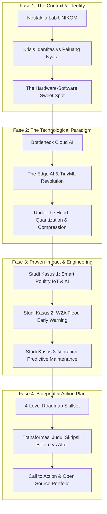
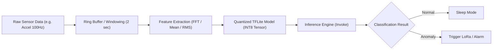

# Buku Panduan & Master Materi Presentasi
## Alumni Insight Series 2026 – Program Studi Sistem Komputer UNIKOM

* **Topik Utama:** *Computer Engineering Beyond 2026: IoT, Edge AI, and The Future of Connected Systems*
* **Pembicara:** Anton Prafanto, S.Kom., M.T. (Alumnus S1 Sistem Komputer UNIKOM, S2 Teknik Elektro ITB, Dosen & Peneliti Informatika UNMUL)
* **Target Audiens:** Mahasiswa Aktif S1 Sistem Komputer (Tingkat Awal s/d Tingkat Akhir), Calon Lulusan, Dosen, dan Alumni UNIKOM.
* **Format Acara:** Keynote Presentation (~45–60 Menit) dilanjutkan Sesi Tanya Jawab Interaktif (~30 Menit).
* **Versi Dokumen:** Masterclass Edition (Lengkap dengan Teks Slide, Naskah Pembicara, Cuplikan Kode, Diagram Arsitektur, Prediksi Tanya Jawab, dan Lembar Panduan Mahasiswa).

---

## DAFTAR ISI

1. [Peta Konsep & Arsitektur Utama Materi](#1-peta-konsep--arsitektur-utama-materi)
2. [Slide-by-Slide: Konten Layar, Skrip Narasi, dan Transisi](#2-slide-by-slide-konten-layar-skrip-narasi-dan-transisi)
3. [Arsitektur Teknis & Cuplikan Kode (Technical Deep-Dive)](#3-arsitektur-teknis--cuplikan-kode-technical-deep-dive)
4. [Tabel Komparasi Hardware & Ekosistem Edge AI 2026](#4-tabel-komparasi-hardware--ekosistem-edge-ai-2026)
5. [Bank Ide Tugas Akhir / Skripsi Terapan Berbobot Publikasi & HKI](#5-bank-ide-tugas-akhir--skripsi-terapan-berbobot-publikasi--hki)
6. [Simulasi & Antisipasi Tanya Jawab (Q&A Preparation)](#6-simulasi--antisipasi-tanya-jawab-qa-preparation)
7. [Checklist Persiapan Teknis & Showmanship Hari-H](#7-checklist-persiapan-teknis--showmanship-hari-h)

---

## 1. PETA KONSEP & ARSITEKTUR UTAMA MATERI

Materi ini dibangun menggunakan struktur **"The Hero's Journey of an Engineer"**—menghubungkan identitas mahasiswa Sistem Komputer dengan tantangan industri nyata dan solusi teknologi masa depan.



---

## 2. SLIDE-BY-SLIDE: KONTEN LAYAR, SKRIP NARASI, DAN TRANSISI

---

### **SLIDE 1: JUDUL & PEMBUKA**
* **Tampilan Layar (Slide Elements):**
  * Judul Utama: **Computer Engineering Beyond 2026**
  * Subjudul: *IoT, Edge AI, and The Future of Connected Systems*
  * Badge/Logo: Logo UNIKOM & Logo Prodi Sistem Komputer
  * Profil Singkat: **Anton Prafanto, S.Kom., M.T.** (Alumnus S1 SK UNIKOM '11 | S2 STEI ITB | Dosen Informatika UNMUL)
  * Visual: Ilustrasi chip mikrokontroler dengan jalur sirkuit menyala yang membentuk jaringan *neural network* terhubung ke dunia nyata.

* **Naskah Pembicara (Verbatim Script):**
  > "Assalamu’alaikum Warahmatullahi Wabarakatuh, Salam sejahtera untuk kita semua.
  > 
  > Yang saya hormati Bapak/Ibu Dosen, pimpinan Program Studi Sistem Komputer UNIKOM, rekan-rekan panitia, dan yang paling saya banggakan: adik-adik mahasiswa Sistem Komputer UNIKOM.
  > 
  > Berdiri di panggung ini, di hadapan almamater tempat saya pertama kali belajar memegang solder, membaca datasheet, dan memprogram mikrokontroler, adalah sebuah kehormatan dan kebahagiaan luar biasa. Hari ini, kita tidak hanya akan bernostalgia tentang masa kuliah, tetapi kita akan menatap masa depan: **Ke mana arah dunia teknik komputer menuju tahun 2026 dan seterusnya?** Mengapa kalian yang berada di ruangan ini sesungguhnya sedang memegang kunci revolusi teknologi berikutnya?"

* **Jembatan Transisi:**
  > *"Untuk memahaminya, mari kita mulai dari tempat di mana cerita kita semua bermula..."*

---

### **SLIDE 2: NOSTALGIA & THE ROOTS (IDENTITAS SISTEM KOMPUTER)**
* **Tampilan Layar (Slide Elements):**
  * Headline: **Dari Lab Perangkat Keras ke Panggung Dunia**
  * 3 Gambar Perjalanan:
    1. *Lab Days:* Breadboard, kabel jumper kusut, mikrokontroler 8-bit, kode Assembly / C.
    2. *The Doubt:* "Apakah anak Sistem Komputer kalah bersaing dengan Software Engineer murni?"
    3. *The Truth:* Pemahaman fisik (elektronika + memori + register) adalah keunggulan langka di dunia modern.
  * Quote Kunci: *"Software exists in the abstract, but computing happens in the physical world."*

* **Naskah Pembicara (Verbatim Script):**
  > "Saya yakin banyak di antara adik-adik di sini pernah mengalami fase yang sama seperti saya dulu: Begadang di lab, jari kena panas solder, pusing mencari resistor yang hilang nilainya, atau debugging kenapa interupsi timer di mikrokontroler tidak jalan.
  > 
  > Kadang, di tengah ramainya hype aplikasi mobile dan startup software, terselip keraguan: *'Apakah belajar hardware dan arsitektur komputer ini masih punya masa depan cerah?'*
  > 
  > Izinkan saya menegaskan hari ini: **Iya, sangat cerah!** Karena aplikasi secanggih apapun, sistem AI serumit apapun, pada akhirnya harus dieksekusi di atas perangkat keras fisik. Dan orang yang paling mengerti bagaimana arsitektur perangkat keras dan sistem embedded itu bekerja adalah kalian, mahasiswa Sistem Komputer."

* **Jembatan Transisi:**
  > *"Tapi dunia sedang berubah drastis. Mari kita lihat apa yang sedang terjadi di peta teknologi global..."*

---

### **SLIDE 3: PERGESERAN PARADIGMA: FROM CLOUD-FIRST TO EDGE-FIRST**
* **Tampilan Layar (Slide Elements):**
  * Headline: **Paradox of Cloud AI: Mengapa Cloud Saja Tidak Cukup?**
  * Tabel Komparasi Visual:
    * **Cloud-Centric AI (2015–2024):** Sensor $\rightarrow$ Internet $\rightarrow$ Server GPU Raksasa $\rightarrow$ Aksi.
      * ❌ *Latency Tinggi* (100–1000 ms)
      * ❌ *Bandwidth Heavy* (Streaming gigabyte data mentah)
      * ❌ *Ketergantungan Sinyal* (Zero internet = zero brain)
      * ❌ *Privacy Risk* (Data kamera/suara/privat keluar gedung)
      * ❌ *Power Hungry* (Transmisi radio terus menerus)
    * **Edge AI & TinyML (2026+):** Sensor $\rightarrow$ On-Chip Inference Langsung di Mikrokontroler.
      * ✅ *Ultra-Low Latency* (< 10 ms)
      * ✅ *Zero Bandwidth* (Hanya kirim insight/hasil)
      * ✅ *Always-On & Offline Resilient*
      * ✅ *Privacy by Design* (Data mentah tidak pernah keluar perangkat)
      * ✅ *Ultra-Low Power* (Bisa beroperasi berbulan-bulan dengan baterai koin)

* **Naskah Pembicara (Verbatim Script):**
  > "Selama sepuluh tahun terakhir, kita terbiasa dengan pola pikir 'lempar semua data ke Cloud'. Tapi mari kita hadapi realitas teknik: Jika sebuah mobil otonom butuh waktu 500 milidetik menunggu balasan cloud hanya untuk mendeteksi penyeberang jalan, itu bencana.
  > 
  > Begitu juga stasiun deteksi banjir di pelosok sungai Kalimantan, atau sensor pemantau mesin di lantai pabrik berdebu—di sana tidak ada Wi-Fi kencang. Kita tidak bisa bergantung pada cloud.
  > 
  > Industri dunia kini menyadari: **Jangan bawa data mentah ke komputer di awan, tapi bawalah kecerdasan komputer ke tempat di mana data itu dilahirkan!** Inilah era Edge AI."

* **Jembatan Transisi:**
  > *"Lalu, di mana posisi kita sebagai lulusan Sistem Komputer dalam era ini?"*

---

### **SLIDE 4: THE TRIFECTA – SUPERPOWER LULUSAN SISTEM KOMPUTER**
* **Tampilan Layar (Slide Elements):**
  * Headline: **The Trifecta of Connected Intelligence**
  * Diagram Venn 3 Lingkaran:
    * **Lingkaran 1 (Hardware & Embedded):** Mikrokontroler, ADC, GPIO, Low-power Design, RTOS, Bus (I2C/SPI/UART).
    * **Lingkaran 2 (Connectivity & Networks):** MQTT, LoRaWAN, BLE Mesh, REST API, WSN Telemetry.
    * **Lingkaran 3 (Artificial Intelligence):** Machine Learning, TinyML, Signal Processing, Neural Networks.
  * **Sweet Spot di Tengah:** **Intelligent Edge Engineer** (*Peran yang paling dicari manufaktur, otomotif, agrikultur, dan smart city!*)

* **Naskah Pembicara (Verbatim Script):**
  > "Lihat diagram ini. Rekan-rekan dari program studi informatika murni mungkin sangat hebat dalam algoritma AI. Rekan-rekan dari sistem informasi hebat dalam proses bisnis.
  > 
  > Tapi siapa yang mampu mengambil sinyal analog dari sensor getaran, mengonversinya lewat ADC, melakukan Fast Fourier Transform (FFT), memasukkannya ke model TinyML di dalam chip 32-bit seharga 50 ribu rupiah, lalu mengirimkan peringatannya via LoRaWAN sejauh 5 kilometer?
  > 
  > **Hanya orang yang paham hardware, jaringan, dan AI secara serentak. Dan itu adalah kalian!** Ini adalah *unfair advantage* kita."

* **Jembatan Transisi:**
  > *"Tapi pertanyaannya: Bagaimana mungkin model AI yang butuh komputer jutaan rupiah bisa muat di mikrokontroler kecil?"*

---

### **SLIDE 5: TINYML UNDER THE HOOD – MEMBEDAH RAHASIA TEKNIS**
* **Tampilan Layar (Slide Elements):**
  * Headline: **Bagaimana Memasukkan AI Ratusan MB ke RAM 320 KB?**
  * 3 Rukun Kompresi Model AI:
    1. **Post-Training Quantization (PTQ):** Menurunkan presisi matematika dari `Float32` (32-bit) ke `Int8` (8-bit) $\rightarrow$ Ukuran model menyusut **75%**, komputasi **4x lebih cepat**, akurasi nyaris identik.
    2. **Pruning & Sparsity:** Memangkas bobot synapse yang bernilai mendekati nol.
    3. **Hardware Acceleration:** Memanfaatkan instruksi SIMD/Vector pada silikon (misal: ESP32-S3 Vector Extension).
  * Framework Utama: **TensorFlow Lite for Microcontrollers (TFLM)**, **Edge Impulse**, **MicroPython**, **CMSIS-NN**.

* **Naskah Pembicara (Verbatim Script):**
  > "Banyak orang mengira AI itu harus selalu memakai GPU NVIDIA seharga puluhan juta. Itu untuk melatih (training). Tapi untuk menjalankan (inference), kita bisa melakukannya di mikrokontroler berdaya 1 watt.
  > 
  > Rahasianya ada pada arsitektur komputer. Model matematika yang tadinya menggunakan bilangan pecahan 32-bit (Floating Point) kita konversi menjadi bilangan bulat 8-bit (Integer). Mikrokontroler kita sangat mahir melakukan operasi integer!
  > 
  > Hasilnya? Model klasifikasi suara atau deteksi anomali getaran yang tadinya 20 Megabyte, bisa kita padatkan menjadi hanya 45 Kilobyte—cukup berjalan santai di memori internal ESP32!"

* **Jembatan Transisi:**
  > *"Mari kita lihat bagaimana teori ini saya buktikan langsung dalam riset dan implementasi nyata di lapangan..."*

---

### **SLIDE 6: STUDI KASUS NYATA – RISET & HILIRISASI DI LAPANGAN**
* **Tampilan Layar (Slide Elements):**
  * Headline: **Dari Lab Menjadi Solusi Nyata & Hak Kekayaan Intelektual (HKI)**
  * 3 Kotak Kasus Terapan:
    * **Kasus 1: Smart Broiler Poultry Farm (Pemberdayaan Peternak)**
      * *Masalah:* Suhu panas & gas amonia membunuh ribuan ayam broiler.
      * *Solusi:* Edge Node berbasis sensor DHT22/MQ + Kontrol adaptif mikroklimat cerdas. Menghasilkan HKI & video edukasi peternak.
    * **Kasus 2: POPULING (Polisi Polusi Udara Keliling – JNTETI SINTA 2)**
      * *Masalah:* Pemantauan polusi udara perkotaan terhambat tingginya biaya stasiun tetap ($10.000–$50.000) dan minimnya titik sensor.
      * *Solusi:* Mobile IoT node pada sepeda motor (ESP32, PMS9103M laser, BME280, GPS, MQTT Antares) untuk memetakan PM2.5/PM10 dan ISPU di 862 titik Kota Samarinda dengan biaya hanya ~$87 (1% dari stasiun tetap). Terbit di Jurnal Nasional Terakreditasi SINTA 2 (JNTETI UGM).
    * **Kasus 3: Vibration Predictive Maintenance (Deteksi Kerusakan Motor Industri)**
      * *Solusi:* Sensor IMU + TinyML mengenali getaran 'sehat' vs 'bearing rusak' sebelum mesin terbakar.

* **Naskah Pembicara (Verbatim Script):**
  > "Ketika kami merancang riset POPULING (pemantauan polusi udara bergerak di Samarinda yang terbit di JNTETI SINTA 2) dan otomatisasi kandang ayam pintar, prinsip saya sederhana: **Engineering yang baik adalah engineering yang menyelesaikan masalah nyata orang banyak.**
  > 
  > Di kandang ayam, jika listrik atau internet mati, sistem tidak boleh lumpuh. Mikrokontroler lokal harus cukup pintar untuk mengambil keputusan menyalakan kipas atau pendingin secara mandiri. Begitu pula pada POPULING, sistem IoT bergerak ini mampu memetakan kualitas udara di 862 titik kota dengan biaya hanya satu persen dari stasiun pemantau konvensional.
  > 
  > Proyek-proyek ini tidak hanya berhenti di meja tugas akhir, tapi kami daftarkan Hak Ciptanya (HKI) ke Kemenkumham dan kami publikasikan di jurnal ilmiah terakreditasi. Adik-adik di UNIKOM juga bisa melakukan hal yang sama!"

* **Jembatan Transisi:**
  > *"Pertanyaan praktisnya: Hardware apa yang harus kalian beli dan pelajari sekarang?"*

---

### **SLIDE 7: LANDSKAP PERANGKAT KERAS 2026 (RAMAH KANTONG MAHASISWA)**
* **Tampilan Layar (Slide Elements):**
  * Headline: **Board Edge AI Pilihan 2026 (< Rp 200.000)**
  * Galeri 4 Board Juara:
    1. **ESP32-S3 (Dual Core Xtensa + Vector AI):** Paling populer, support Wi-Fi/BLE, kamera, kencang untuk speech & vision sederhana. (~Rp 75.000 – Rp 120.000).
    2. **Raspberry Pi Pico 2 (RP2350 - ARM Cortex-M33 + Hazard3 RISC-V):** Arsitektur ganda modern, hemat daya luar biasa, sangat cocok untuk TinyML sensor. (~Rp 85.000).
    3. **Kendryte K210 / Sipeed Maixduino:** Dilengkapi NPU/KPU dedicated hardware untuk vision 60 FPS real-time. (~Rp 150.000 – Rp 250.000).
    4. **STM32 Series + ST Edge AI Tool:** Standar industri global manufaktur otomotif.

* **Naskah Pembicara (Verbatim Script):**
  > "Kabar terbaik bagi mahasiswa saat ini: Untuk belajar teknologi tercanggih, kalian tidak butuh modal puluhan juta.
  > 
  > Board seperti ESP32-S3 atau Raspberry Pi Pico harganya setara dengan dua mangkok bakso atau beberapa gelas kopi kekinian. Di dalam chip sekecil koin itu sudah ada instruksi akselerasi vektor untuk mengeksekusi model machine learning.
  > 
  > Jangan menunggu kampus menyediakan alat mahal. Mulailah bereksplorasi dari meja kosan kalian!"

* **Jembatan Transisi:**
  > *"Lalu bagaimana peta jalan belajarnya agar tidak bingung mulai dari mana?"*

---

### **SLIDE 8: 4-LEVEL SKILLSET ROADMAP (PETA JALAN BELAJAR MAHASISWA)**
* **Tampilan Layar (Slide Elements):**
  * Headline: **Roadmap: From Student to Edge AI Engineer**
  * Infografis 4 Tahapan:
    * **Level 1: Hardware & Low-Level Mastery** $\rightarrow$ C/C++, Memory Map, Register, Timer, Interrupt, Low-Power Sleep Modes, Breadboarding.
    * **Level 2: Network & Protocols** $\rightarrow$ MQTT, LoRaWAN, BLE, I2C/SPI Bus, REST API, JSON serialization.
    * **Level 3: Edge AI & Intelligence** $\rightarrow$ Python, Edge Impulse Platform, Data Collection, Model Quantization, TFLite Micro.
    * **Level 4: Productization & Full-Stack** $\rightarrow$ Flutter Dashboard, Cloud Telemetry, OTA Firmware Update, Enclosure Design 3D Print.

* **Naskah Pembicara (Verbatim Script):**
  > "Ini adalah roadmap yang saya susun khusus untuk mahasiswa Sistem Komputer.
  > 
  > Di semester awal, kuatkan Level 1: jangan alergi C/C++ dan datasheet. Di semester tengah, kuasai komunikasi jaringan di Level 2.
  > 
  > Masuk ke tingkat akhir, naikkan kelas kalian ke Level 3 dengan memasukkan model kecerdasan buatan. Dan jika kalian ingin karya kalian dilirik industri atau investor, kemas di Level 4 dengan dashboard mobile Flutter dan casing 3D print yang rapi. Kalian akan menjadi lulusan yang sangat bernilai tinggi."

* **Jembatan Transisi:**
  > *"Sekarang mari kita lihat bagaimana cara mengubah judul skripsi kalian menjadi sesuatu yang luar biasa..."*

---

### **SLIDE 9: UPGRADE SKRIPSI & PORTOFOLIO: "BEYOND 2026"**
* **Tampilan Layar (Slide Elements):**
  * Headline: **Transformasi Ide Skripsi: Standar Lama vs Standar 2026**
  * Tabel Transformasi Ide:
    | Ide Standar Lama (Usang) | Ide 'Beyond 2026' (High Value) |
    | :--- | :--- |
    | *Monitoring Suhu Ruangan dengan Arduino & Blynk* | **Edge AI Node untuk Prediksi Titik Embun & Anomali Termal Menggunakan TinyML pada ESP32-S3** |
    | *Alat Pengukur Kualitas Air Kolam Ikan* | **Smart Aquaculture Terdistribusi Berbasis LoRaWAN & Inferensi Kualitas Air Otomatis (Fuzzy/ML)** |
    | *Kamera Keamanan Pendeteksi Gerakan PIR* | **Ultra Low-Power Wake-Word & Object Recognition Camera Menggunakan TinyML (Baterai Tahan 6 Bulan)** |
    | *Monitoring Getaran Mesin Dinamo* | **Predictive Maintenance System Berbasis FFT & Anomaly Detection TinyML untuk Klasifikasi Kerusakan Motor** |
  * Pesan Aksi: **Build in Public!** Unggah kodingan di **GitHub**, dokumentasikan di LinkedIn, daftarkan HKI.

* **Naskah Pembicara (Verbatim Script):**
  > "Tolong, adik-adik mahasiswa tingkat akhir: **Hentikan membuat judul skripsi 'Monitoring Suhu dengan Blynk'!** Judul itu sudah ada sejak 10 tahun lalu.
  > 
  > Naikkan standar kalian. Tambahkan sentuhan TinyML, tambahkan arsitektur low-power, gunakan protokol modern seperti LoRaWAN atau MQTT.
  > 
  > Dan yang paling penting: Jangan biarkan kode kalian membusuk di flashdisk. Unggah ke GitHub! Saya sendiri mendokumentasikan lebih dari 130 repositori di GitHub. Ketika kalian melamar kerja atau beasiswa, link GitHub dan sertifikat HKI jauh lebih berbicara daripada sekadar transkrip nilai."

* **Jembatan Transisi:**
  > *"Sebagai penutup, ada sebuah pesan yang ingin saya titipkan untuk kalian semua..."*

---

### **SLIDE 10: PENUTUP & PESAN UNTUK ALMAMATER (CALL TO ACTION)**
* **Tampilan Layar (Slide Elements):**
  * Headline Utama: **"Masa Depan Komputasi Cerdas, Ada di Tangan Kalian."**
  * Pesan Inti:
    1. Banggalah menjadi mahasiswa Sistem Komputer UNIKOM.
    2. Dunia fisik menanti sentuhan kecerdasan buatan dari tangan kalian.
    3. Mulai hari ini: 1 Baris C++, 1 Model AI, 1 Proyek Nyata.
  * Kontak & Link Portofolio:
    * Email: `antonprafanto@unmul.ac.id`
    * GitHub: `github.com/antonprafanto`
    * Google Scholar: `Anton Prafanto`
  * Teks Besar: **TERIMA KASIH & SESI TANYA JAWAB (Q&A)**

* **Naskah Pembicara (Verbatim Script):**
  > "Rekan-rekan mahasiswa sekalian, dua puluh tahun terakhir dunia berhasil membangun internet di balik layar kaca smartphone dan laptop.
  > 
  > Namun dua puluh tahun ke depan, dunia akan membangun kecerdasan pada jutaan benda fisik di sekitar kita: pada turbin angin, pada mobil listrik, pada tanah pertanian, pada jembatan kota, hingga pada peralatan medis.
  > 
  > Kalianlah generasi penerus yang akan menghubungkan dunia digital dengan dunia fisik secara nyata. Jangan pernah merasa rendah diri. Teruslah berkarya, jaga nama baik almamater UNIKOM, dan jadilah praktisi serta inovator yang memberi manfaat seluas-luasnya bagi masyarakat.
  > 
  > Terima kasih banyak atas perhatian rekan-rekan semua. Wabillahi taufiq wal hidayah, Wassalamu’alaikum Warahmatullahi Wabarakatuh. Mari kita berdiskusi!"

---

## 3. ARSITEKTUR TEKNIS & CUPLIKAN KODE (TECHNICAL DEEP-DIVE)

Bagian ini dapat dijadikan materi teknis atau slide lampiran (*Backup Slides*) jika ada pertanyaan mendalam dari dosen atau mahasiswa.

### A. Alur Pemrosesan Sinyal TinyML pada Mikrokontroler


### B. Cuplikan Script Python: Konversi Model ke Format INT8 (Quantization)
```python
import tensorflow as tf

# 1. Load pre-trained neural network model
model = tf.keras.models.load_model('vibration_model.h5')

# 2. Setup TFLite Converter dengan Post-Training Quantization
converter = tf.lite.TFLiteConverter.from_keras_model(model)
converter.optimizations = [tf.lite.Optimize.DEFAULT]

# 3. Representative Dataset Generator (sample data sensor)
def representative_dataset_gen():
    for sample in sensor_calibration_data:
        yield [sample.astype(np.float32)]

converter.representative_dataset = representative_dataset_gen
converter.target_spec.supported_ops = [tf.lite.OpsSet.TFLITE_BUILTINS_INT8]
converter.inference_input_type = tf.int8
converter.inference_output_type = tf.int8

# 4. Konversi ke FlatBuffer byte array
tflite_quant_model = converter.convert()

# 5. Simpan sebagai file header C++ (.h) untuk dimasukkan ke Arduino/ESP32
with open('model_data.h', 'w') as f:
    f.write(convert_to_c_array(tflite_quant_model, "model_data"))
```

### C. Cuplikan C++ pada Mikrokontroler (ESP32 / Arduino TFLM)
```cpp
#include <TensorFlowLite_ESP32.h>
#include "tensorflow/lite/micro/all_ops_resolver.h"
#include "tensorflow/lite/micro/micro_interpreter.h"
#include "tensorflow/lite/schema/schema_generated.h"
#include "model_data.h"

// Alokasi memori untuk Tensor Arena di RAM internal
constexpr int kTensorArenaSize = 10 * 1024; // 10 KB RAM
uint8_t tensor_arena[kTensorArenaSize];

tflite::MicroInterpreter* interpreter;
TfLiteTensor* input_tensor;
TfLiteTensor* output_tensor;

void setup() {
  Serial.begin(115200);
  
  // 1. Load model schema dari array C++
  const tflite::Model* model = tflite::GetModel(model_data);
  static tflite::AllOpsResolver resolver;
  
  // 2. Inisialisasi Interpreter
  static tflite::MicroInterpreter static_interpreter(
      model, resolver, tensor_arena, kTensorArenaSize, nullptr);
  interpreter = &static_interpreter;
  interpreter->AllocateTensors();
  
  input_tensor = interpreter->input(0);
  output_tensor = interpreter->output(0);
}

void loop() {
  // 3. Baca sensor getaran / IMU
  float raw_x = read_accelerometer_x();
  input_tensor->data.int8[0] = quantize_input(raw_x); // input scale
  
  // 4. Jalankan inferensi AI lokal (hanya ~12 milidetik!)
  TfLiteStatus invoke_status = interpreter->Invoke();
  
  // 5. Baca hasil probabilitas anomali
  int8_t anomaly_score = output_tensor->data.int8[0];
  if (anomaly_score > THRESHOLD) {
    Serial.println("PERINGATAN: Kerusakan Bantalan Mesin Terdeteksi!");
  }
  delay(100);
}
```

---

## 4. TABEL KOMPARASI HARDWARE & EKOSISTEM EDGE AI 2026

| Board / Chip | Arsitektur CPU | Clock & RAM | Akselerasi AI Khusus | Konsumsi Daya | Kisaran Harga (IDR) | Terbaik Untuk |
| :--- | :--- | :--- | :--- | :--- | :--- | :--- |
| **ESP32-S3** | Dual-core Xtensa 32-bit LX7 | 240 MHz, 512 KB SRAM + PSRAM | Instruksi Vektor (SIMD) | Sedang (WiFi Aktif) | Rp 75.000 – 120.000 | Audio, IoT Vision, Keyword Spotting |
| **RP2350 (Pico 2)** | Dual ARM Cortex-M33 / RISC-V | 150 MHz, 520 KB SRAM | DSP & Co-processor | Sangat Rendah | Rp 80.000 – 95.000 | Sensor IMU, Anomaly Detection, Baterai |
| **Kendryte K210** | Dual 64-bit RISC-V | 400 MHz, 8 MB SRAM | Dedicated KPU (0.8 TOPS) | Sedang | Rp 150.000 – 250.000 | Face Detection, YOLO Object Detection |
| **STM32F4 / H7** | ARM Cortex-M4 / M7 | 168 – 480 MHz, Up to 2 MB | CMSIS-NN + ST X-CUBE-AI | Rendah | Rp 60.000 – 200.000 | Standar Industri, Kontrol Mesin |
| **Arduino Nano 33 BLE** | Nordic nRF52840 (Cortex-M4F) | 64 MHz, 256 KB RAM | BLE 5.0 + 9-axis Sensor | Sangat Rendah | Rp 250.000 – 350.000 | Wearable AI, Deteksi Gestur Tubuh |

---

## 5. BANK IDE TUGAS AKHIR / SKRIPSI TERAPAN BERBOBOT PUBLIKASI & HKI

Pak Anton dapat membagikan inspirasi judul skripsi ini langsung kepada mahasiswa dan dosen pembimbing:

### Domain 1: Smart Agriculture & Peternakan
1. *Rancang Bangun Edge Node Pendeteksi Dini Batuk/Suara Penyakit Ternak Ayam Menggunakan Audio TinyML.*
2. *Sistem Smart Irigasi Presisi Berbasis LoRaWAN dengan Prediksi Kelembaban Tanah Menggunakan Regresi TinyML.*
3. *Klasifikasi Kematangan Buah Kelapa Sawit Otomatis pada Kamera ESP32-S3 Menggunakan MobileNet INT8.*

### Domain 2: Kebencanaan, Lingkungan & Smart City
1. *Stasiun Telemetri Sungai Cerdas dengan Prediksi Debit Banjir Menggunakan Algoritma ANFIS/TinyML Terdesentralisasi.*
2. *Deteksi Dini Kebakaran Hutan Menggunakan Jaringan Sensor Nirkabel (WSN) dan Anomaly Detection Sensor Gas MQ.*
3. *Sistem Smart Streetlight Otomatis Berbasis Klasifikasi Suara Lalu Lintas dan Kepadatan Kendaraan di Edge.*

### Domain 3: Industri, Energi & Biomedical
1. *Predictive Maintenance Getaran Motor Induksi Menggunakan Accelerometer dan Fast Fourier Transform (FFT) pada ESP32.*
2. *Deteksi Aritmia Jantung pada Sinyal EKG Portabel Berbasis TinyML Menggunakan Board NRF52840.*
3. *Smart Energy Meter Berbasis Non-Intrusive Load Monitoring (NILM) Menggunakan Machine Learning pada Edge Device.*

---

## 6. SIMULASI & ANTISIPASI TANYA JAWAB (Q&A PREPARATION)

Berikut adalah pertanyaan-pertanyaan yang paling sering muncul dari mahasiswa dan dosen, beserta strategi jawaban taktis:

---

#### **Q1 (Dari Mahasiswa Tingkat Awal):**
*"Pak, saya baru semester 2 atau 4 dan belum belajar AI. Apakah saya harus menunggu mata kuliah AI untuk mulai belajar Edge AI?"*
* **Jawaban Pak Anton:**
  > "Sama sekali tidak perlu menunggu! Mulailah dari platform no-code/low-code seperti **Edge Impulse (edgeimpulse.com)**. Di sana adik-adik bisa menghubungkan HP atau ESP32, merekam data sensor (misal gerakan tangan melambaikan HP), melatih model dengan satu tombol, dan langsung mengekspor kodenya ke library Arduino C++. Dari situ kalian akan paham konsepnya secara praktis sebelum belajar teori matematikanya di kelas."

---

#### **Q2 (Dari Mahasiswa Tingkat Akhir):**
*"Pak, apakah akurasi TinyML di mikrokontroler sebanding dengan model AI di server Cloud?"*
* **Jawaban Pak Anton:**
  > "Untuk tugas spesifik (Narrow AI)—seperti membedakan getaran normal vs getaran rusak, mendeteksi kata kunci suara, atau mengenali objek tertentu—akurasinya setelah dikuantisasi ke INT8 penurunannya biasanya **kurang dari 1% sampai 2%**, tetapi kita mendapatkan keuntungan penghematan memori hingga 75% dan latensi instan tanpa internet. Dalam rekayasa komputer, *trade-off* ini adalah kemenangan besar."

---

#### **Q3 (Dari Dosen / Akademisi UNIKOM):**
*"Bagaimana strategi Pak Anton dalam membimbing mahasiswa agar tugas akhirnya bisa tembus publikasi SINTA/IEEE dan meraih HKI?"*
* **Jawaban Pak Anton:**
  > "Kuncinya ada pada dua hal: **Konteks Masalah yang Riil** dan **Metodologi Pengujian yang Terukur**. Jangan hanya menguji alat di lab selama 5 menit. Pasang alat tersebut di lokasi nyata (kandang ayam, pinggir sungai, mesin bengkel) selama 1-2 minggu. Ambil data performa: latensi inferensi, konsumsi arus (mA), dan perbandingan akurasi. Data empiris itulah yang sangat disukai oleh reviewer jurnal internasional dan IEEE."

---

#### **Q4 (Dari Mahasiswa yang Ragu Masuk Dunia Hardware):**
*"Pak, sekarang gaji Software Engineer terasa sangat menggiurkan. Apakah berkarier di bidang Embedded / Hardware menjanjikan secara finansial?"*
* **Jawaban Pak Anton:**
  > "Pasar software murni saat ini sangat kompetitif dan jenuh karena lulusannya banyak sekali. Tapi ketika perusahaan otomotif (mobil listrik/EV), industri manufaktur, drone, IoT, dan robotika mencari insinyur, mereka sangat kesulitan mencari orang yang bisa coding sekaligus mengerti sirkuit hardware. Keahlian langka selalu dihargai dengan kompensasi yang sangat tinggi. Jangan khawatir!"

---

## 7. CHECKLIST PERSIAPAN TEKNIS & SHOWMANSHIP HARI-H

| Item / Aktivitas | Keterangan & Detail | Status |
| :--- | :--- | :---: |
| **Alat Peraga (Physical Prop)** | Bawa 1 unit ESP32-S3 atau board mikrokontroler kecil di saku jas/kemeja untuk ditunjukkan ke audiens saat Slide 5/7. | [ ] |
| **Slide Remote / Pointer** | Gunakan wireless clicker agar bebas bergerak di panggung (*stage presence* aktif). | [ ] |
| **Cadangan Format File** | Siapkan file slide dalam format `.PPTX`, `.PDF` (resolusi 16:9), dan salinan di Google Drive / Flashdisk. | [ ] |
| **Interactive Moment** | Di Slide 2 atau 4, ajak interaksi: *"Coba angkat tangan siapa di sini yang pernah kena solder waktu praktikum?"* untuk mencairkan suasana. | [ ] |
| **QR Code Portofolio** | Letakkan QR Code menuju GitHub (`github.com/antonprafanto`) atau LinkedIn di slide terakhir untuk jejaring mahasiswa. | [ ] |

---
*Dokumen ini disusun sebagai panduan lengkap untuk memastikan sesi Alumni Insight Series 2026 berjalan sukses, inspiratif, dan memberikan dampak jangka panjang bagi almamater UNIKOM.*
