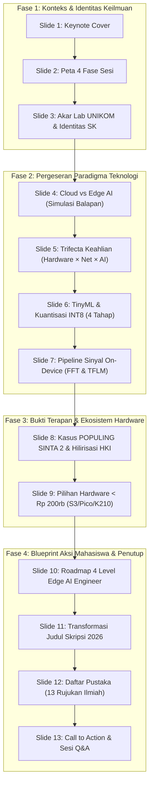
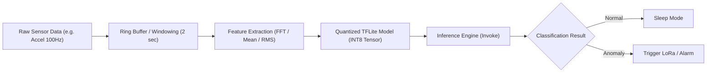

# Buku Panduan & Master Materi Presentasi
## Alumni Insight Series 2026 – Program Studi Sistem Komputer UNIKOM

* **Topik Utama:** *Computer Engineering Beyond 2026: IoT, Edge AI, and The Future of Connected Systems*
* **Pembicara:** Anton Prafanto, S.Kom., M.T. (Alumnus S1 Sistem Komputer UNIKOM, S2 Teknik Elektro ITB, Dosen & Peneliti Informatika UNMUL)
* **Target Audiens:** Mahasiswa Aktif S1 Sistem Komputer (Tingkat Awal s/d Tingkat Akhir), Calon Lulusan, Dosen, dan Alumni UNIKOM.
* **Format Acara:** Keynote Presentation (~45–60 Menit) dilanjutkan Sesi Tanya Jawab Interaktif (~30 Menit).
* **Versi Dokumen:** Masterclass Edition (Lengkap dengan Teks Slide, Naskah Pembicara, Cuplikan Kode, Diagram Arsitektur, Prediksi Tanya Jawab, dan Lembar Panduan Mahasiswa).

---

## DAFTAR ISI

1. [Peta Konsep & Arsitektur Utama Materi](#1-peta-konsep--arsitektur-utama-materi)
2. [Slide-by-Slide: Konten Layar, Skrip Narasi, dan Transisi](#2-slide-by-slide-konten-layar-skrip-narasi-dan-transisi)
3. [Arsitektur Teknis & Cuplikan Kode (Technical Deep-Dive)](#3-arsitektur-teknis--cuplikan-kode-technical-deep-dive)
4. [Tabel Komparasi Hardware & Ekosistem Edge AI 2026](#4-tabel-komparasi-hardware--ekosistem-edge-ai-2026)
5. [Bank Ide Tugas Akhir / Skripsi Terapan Berbobot Publikasi & HKI](#5-bank-ide-tugas-akhir--skripsi-terapan-berbobot-publikasi--hki)
6. [Simulasi & Antisipasi Tanya Jawab (Q&A Preparation)](#6-simulasi--antisipasi-tanya-jawab-qa-preparation)
7. [Checklist Persiapan Teknis & Showmanship Hari-H](#7-checklist-persiapan-teknis--showmanship-hari-h)

---

## 1. PETA KONSEP & ARSITEKTUR UTAMA MATERI

Materi ini dibangun menggunakan struktur **"The Hero's Journey of an Engineer"**—menghubungkan identitas mahasiswa Sistem Komputer dengan tantangan industri nyata dan solusi teknologi masa depan.



---

## 2. SLIDE-BY-SLIDE: KONTEN LAYAR, SKRIP NARASI, DAN TRANSISI

---

### **SLIDE 1: JUDUL & PEMBUKA (KEYNOTE COVER)**
* **Tampilan Layar (Slide Elements):**
  * Badge/Pill: `UNIKOM Alumni Insight 2026` · `Keynote Presentation · 45–60 Menit + Tanya Jawab`
  * Judul Utama: **Computer Engineering <span style="text-decoration:underline;text-decoration-color:#E63946;">Beyond 2026</span>**
  * Subjudul: *IoT, Edge AI, dan masa depan sistem cerdas terdistribusi — Mengapa lulusan Sistem Komputer menjadi penentu arsitektur komputasi fisik.*
  * Visual: Ilustrasi chip mikrokontroler dengan node konektivitas fisik menuju jaringan cerdas (*circuit diagram*).
  * Profil Narasumber: **Anton Prafanto, S.Kom., M.T.** (*Alumnus S1 Sistem Komputer UNIKOM '11 · S2 STEI ITB · Dosen Informatika UNMUL*).

* **Naskah Pembicara (Verbatim Script):**
  > "Assalamu’alaikum Warahmatullahi Wabarakatuh, Salam sejahtera untuk kita semua.
  > 
  > Yang saya hormati Bapak/Ibu Dosen, pimpinan Program Studi Sistem Komputer UNIKOM, rekan-rekan panitia, dan yang paling saya banggakan: adik-adik mahasiswa Sistem Komputer UNIKOM.
  > 
  > Hadir kembali di almamater tercinta tempat saya pertama kali belajar memegang solder, membaca datasheet, dan memprogram mikrokontroler, adalah sebuah kehormatan dan kebahagiaan yang sangat luar biasa.
  > 
  > Hari ini, kita tidak hanya akan bernostalgia tentang masa-masa kuliah, tetapi kita akan menatap ke depan: **Ke mana arah dunia teknik komputer menuju tahun 2026 dan seterusnya?** Mengapa kalian yang berada di ruangan ini sesungguhnya sedang memegang kunci masa depan arsitektur komputasi fisik dunia?"

* **Jembatan Transisi:**
  > *"Untuk memahaminya, mari kita lihat peta perjalanan yang akan kita lalui bersama pada sesi hari ini..."*

---

### **SLIDE 2: PETA SESI (EMPAT FASE PERJALANAN)**
* **Tampilan Layar (Slide Elements):**
  * Headline: **Empat Fase Perjalanan di Bidang Sistem Komputer**
  * Kicker: *Peta Sesi · Klik kartu untuk berpindah slide langsung*
  * 4 Kartu Fase Interaktif:
    1. **01 Identitas · Akar Lab UNIKOM:** Dari solder dan breadboard ke sinergi keahlian hardware + software.
    2. **02 Paradigma · Cloud $\rightarrow$ Edge AI:** Mengapa data sensor tidak harus selalu dikirim ke server cloud. (Sitasi [1])
    3. **03 Dampak · TinyML & Kasus Nyata:** Kuantisasi model INT8, studi kasus POPULING SINTA 2, dan perlindungan HKI. (Sitasi [2][4])
    4. **04 Aksi · Roadmap & Skripsi 2026:** Pilihan board terjangkau (< Rp 200rb), 4 level peta keahlian, dan transformasi judul tugas akhir. (Sitasi [5][10])

* **Naskah Pembicara (Verbatim Script):**
  > "Presentasi ini saya rancang ke dalam empat babak cerita yang saling menyambung.
  > 
  > Pertama, kita akan merefleksikan **Identitas Keilmuan** kita di Sistem Komputer. Kedua, kita membedah **Pergeseran Paradigma Teknologi** dari komputasi awan menuju kecerdasan langsung di perangkat fisik (*Edge AI*).
  > 
  > Ketiga, saya akan membagikan **Bukti Terapan Nyata & Hilirisasi HKI** dari riset laboratorium yang kami kerjakan hingga terbit di jurnal nasional bereputasi SINTA 2. Dan keempat, kita tutup dengan **Blueprint Aksi**: roadmap belajar terukur dan panduan meningkatkan standar skripsi adik-adik sekalian."

* **Jembatan Transisi:**
  > *"Mari kita mulai dari tempat di mana cerita kita semua bermula: laboratorium perangkat keras Sistem Komputer..."*

---

### **SLIDE 3: 01 AKAR & IDENTITAS (DARI LAB HARDWARE MENUJU SOLUSI MASA DEPAN)**
* **Tampilan Layar (Slide Elements):**
  * Headline: **Dari Lab Hardware Menuju Solusi Masa Depan**
  * 3 Kartu Refleksi:
    1. **The Lab Days:** Solder, breadboard, kabel jumper, interupsi timer, dan register C/Assembly. Fondasi esensial mengenai cara kerja komputasi pada lapisan fisik nyata.
    2. **The Dilemma:** “Apakah lulusan Sistem Komputer kalah bersaing dengan software engineer murni?” Keraguan umum yang perlu dijawab dengan portofolio dan fakta industri.
    3. **The Unfair Advantage:** Software bekerja pada lapisan abstraksi tinggi, namun komputasi nyata selalu berpijak pada silikon perangkat keras. Menguasai arsitektur hardware dan mikrokontroler adalah keunggulan langka di era AI.
  * Pesan Kunci: *“Software exists in the abstract, but computing happens in the physical world.”*
  * Fitur Interaktif: Tombol angkat tangan bagi mahasiswa yang pernah terkena solder saat praktikum.

* **Naskah Pembicara (Verbatim Script):**
  > "Saya yakin banyak di antara adik-adik di sini yang pernah merasakan: begadang di lab, jari terkena panas solder, pusing mencari resistor yang hilang, atau debugging register mikrokontroler yang tidak mau merespons.
  > 
  > Kadang, di tengah ramainya tren aplikasi software murni, muncul keraguan: *'Apakah belajar hardware dan elektronika ini masih punya masa depan cerah?'*
  > 
  > Izinkan saya menegaskan: **Sangat cerah!** Karena secanggih apa pun algoritma software, pada akhirnya kode itu harus dieksekusi di atas silikon perangkat keras fisik. Dan orang yang paling memahami jembatan antara logika software dan arsitektur hardware adalah kalian: mahasiswa Sistem Komputer."

* **Jembatan Transisi:**
  > *"Tapi mengapa industri global saat ini sangat membutuhkan keahlian hardware? Mari kita bedah pergeseran paradigma komputasi awan..."*

---

### **SLIDE 4: 02 PERGESERAN PARADIGMA (CLOUD AI VS EDGE AI)**
* **Tampilan Layar (Slide Elements):**
  * Headline: **Cloud AI vs Edge AI** (Sitasi [1])
  * Komparasi 2 Kolom:
    * **Cloud-Centric AI (Tantangan & Bottleneck):**
      * Latensi Tinggi (100–1000 ms): Tidak andal untuk respons waktu-nyata kritis.
      * Beban Bandwidth: Mengirimkan gigabyte data mentah sensor terus-menerus membebani jaringan.
      * Ketergantungan Jaringan: Sistem lumpuh seketika jika internet lapangan terputus.
      * Risiko Privasi: Data mentah audio/kamera sensitif terekspos keluar jaringan lokal.
    * **Edge AI & TinyML (Solusi On-Device):**
      * Latensi Instan (< 10 ms): Inferensi cerdas dieksekusi langsung di chip lokal. (Sitasi [3])
      * Efisiensi Bandwidth: Hanya mengirimkan ringkasan status anomali atau keputusan akhir.
      * Mandiri Secara Offline: Tetap beroperasi 24/7 tanpa koneksi internet.
      * Privasi Terjaga: Pemrosesan data sensor tuntas di dalam silikon perangkat.
  * Fitur Interaktif: **Simulasi Balapan Kecepatan Respons (Cloud vs Edge)** yang mendemonstrasikan secara visual paket data Edge selesai dalam hitungan milidetik saat Cloud masih dalam transmisi jaringan.

* **Naskah Pembicara (Verbatim Script):**
  > "Selama satu dekade terakhir, industri terbiasa dengan paradigma 'kirim semua data mentah ke cloud'. Tapi di dunia fisik nyata, pola ini menemui batas kritisnya.
  > 
  > Jika sensor rem darurat kendaraan otonom membutuhkan waktu 500 milidetik menunggu balasan server cloud di internet, itu fatal. Begitu pula sensor kualitas udara bergerak di pelosok atau sensor getaran motor di pabrik—kita tidak bisa menjamin koneksi internet selalu stabil.
  > 
  > Solusi dunia masa depan adalah: **Jangan bawa data sensor mentah ke awan, tetapi bawalah kecerdasan buatan ke chip tempat data itu dilahirkan!** Inilah revolusi Edge AI."

* **Jembatan Transisi:**
  > *"Lalu siapa profesi yang paling mampu membangun arsitektur Edge AI terintegrasi ini?..."*

---

### **SLIDE 5: 03 KEUNGGULAN UNIK (TRIFECTA: HARDWARE × JARINGAN × AI)**
* **Tampilan Layar (Slide Elements):**
  * Headline: **Trifecta: Hardware × Jaringan × Kecerdasan Buatan**
  * 3 Kartu Domain Interaktif:
    * **Domain 1 · Hardware & Embedded:** Mikrokontroler, ADC, manajemen daya (sleep mode), bus I2C/SPI/UART, dan RTOS.
    * **Domain 2 · Jaringan & IoT:** Protokol MQTT, LoRaWAN, BLE Mesh, Wireless Sensor Network (WSN), dan telemetri jarak jauh.
    * **Domain 3 · Kecerdasan Buatan (AI):** TinyML, ekstraksi fitur spektral (FFT), kuantisasi model INT8, dan klasifikasi on-device. (Sitasi [4])
  * Sweet Spot Banner: **Intelligent Edge Systems Engineer — 100% Ranah Mahasiswa Sistem Komputer.**

* **Naskah Pembicara (Verbatim Script):**
  > "Mari kita cermati posisi unik kita. Rekan-rekan dari ilmu komputer murni sangat unggul di pemodelan algoritma AI di server. Rekan-rekan dari sistem informasi unggul di manajemen proses bisnis.
  > 
  > Tapi siapa yang mampu mengambil sinyal mikrovolt dari sensor piezoelektrik, membersihkannya melalui filter hardware dan ADC, menghitung Fast Fourier Transform (FFT), menjalankannya pada model AI terkuantisasi di chip seharga 50 ribu rupiah berdaya baterai, lalu mentransmisikan peringatannya via LoRaWAN sejauh 5 km?
  > 
  > **Hanya orang yang menguasai perangkat keras, jaringan, dan AI secara terpadu. Dan itu adalah kalian, mahasiswa Sistem Komputer!** Ini adalah *unfair advantage* kita di bursa industri modern."

* **Jembatan Transisi:**
  > *"Namun timbul pertanyaan teknis mendasar: bagaimana model AI yang berukuran megabyte bisa muat di mikrokontroler dengan memori RAM yang sangat kecil?..."*

---

### **SLIDE 6: 04 ARSITEKTUR TEKNIS (TINYML & POST-TRAINING QUANTIZATION INT8)**
* **Tampilan Layar (Slide Elements):**
  * Headline: **TinyML: Menjalankan Model AI pada Memori Terbatas (RAM Puluhan KB)**
  * 3 Pilar Kompresi Model:
    1. **Post-Training Quantization (PTQ INT8):** Mengonversi bobot jaringan saraf dari `Float32` (32-bit) ke `Int8` (integer 8-bit: −128 s/d 127). Ukuran model menyusut **~75% (4× lebih hemat memori)** dengan akselerasi CPU **3×+ lebih cepat** dan degradasi akurasi sangat minim. (Sitasi [2][11])
    2. **Pemangkasan Bobot (Pruning & Sparsity):** Menghapus koneksi neuron yang bernilai mendekati nol guna menghemat RAM kerja. (Sitasi [12])
    3. **Akselerasi Perangkat Keras:** Memanfaatkan instruksi SIMD/Vektor mikrokontroler (ESP32-S3 PIE dan ARM CMSIS-NN) untuk memproses operasi INT8 secara paralel. (Sitasi [5][9])
  * Fitur Interaktif: **Simulasi Kuantisasi INT8 4 Tahap** (Rumus Affine Mapping $q = \text{round}(r/s) + z$, visualisasi 32 bit Float32 vs 8 bit INT8, meter konsumsi memori/CPU, serta benchmark riil SparkFun Edge Apollo3 Cortex-M4 @ 96 MHz: Keyword Spotting = 0,38 ms, Visual Wake Words = 51 ms). (Sitasi [4][9])

* **Naskah Pembicara (Verbatim Script):**
  > "Banyak orang mengira AI harus selalu dijalankan di server GPU berdaya ratusan watt. Itu berlaku untuk tahap *training*. Tetapi untuk *inference* (pengambilan keputusan di lapangan), kita bisa mengeksekusinya di mikrokontroler berdaya miliwatt.
  > 
  > Kuncinya ada pada optimasi representasi data. Model jaringan saraf yang awalnya menggunakan bilangan pecahan 32-bit (*Floating Point*) kita konversikan ke bilangan bulat 8-bit (*Integer INT8*).
  > 
  > Hasilnya luar biasa: Model klasifikasi suara atau getaran yang tadinya 20 MB menyusut menjadi hanya puluhan Kilobyte—berjalan mulus di memori internal ESP32 atau Cortex-M dengan akselerasi instruksi vektor hardware."

* **Jembatan Transisi:**
  > *"Setelah model AI siap di mikrokontroler, bagaimana sebenarnya alur data sinyal dari sensor fisik hingga menghasilkan aksi nyata?..."*

---

### **SLIDE 7: 05 ALUR PEMROSESAN SINYAL ON-DEVICE (PIPELINE DATA KE KEPUTUSAN)**
* **Tampilan Layar (Slide Elements):**
  * Headline: **Dari Data Sensor Mentah Menuju Aksi Keputusan Lokal**
  * 4 Tahap Pipeline Interaktif:
    1. **1. Akuisisi Sensor:** Membaca data sensor analog/digital (IMU, mikrofon, gas, ADC) dengan frekuensi sampling konstan dan presisi (misal: 50–100 Hz).
    2. **2. Windowing Sinyal:** Menampung deret sampel ke dalam *ring buffer* selama 1–2 detik karena pola getaran/suara memerlukan konteks rentang waktu.
    3. **3. Ekstraksi Fitur (FFT / Spektral):** Mentransformasi sinyal dari domain waktu ke domain frekuensi menggunakan *Fast Fourier Transform* untuk mengekstrak puncak energi unik.
    4. **4. Inferensi TinyML & Aksi:** Model INT8 dieksekusi via runtime TensorFlow Lite Micro (TFLM) dalam hitungan milidetik, memicu aksi relay, alarm, atau transmisi LoRaWAN. (Sitasi [2][4][10])
  * Kotak Detail Interaktif yang memperbarui penjelasan saat tahapan diklik.

* **Naskah Pembicara (Verbatim Script):**
  > "Inilah arsitektur *signal processing pipeline* standar pada perangkat Edge AI.
  > 
  > Pertama, kita mengambil data sensor dengan *sampling rate* yang tepat. Kedua, data ditampung dalam *ring buffer windowing* 1 sampai 2 detik.
  > 
  > Ketiga, kita lakukan ekstraksi fitur spektral lewat FFT agar ciri khas anomali terlihat jelas. Dan keempat, fitur tersebut dimasukkan ke model TinyML INT8 untuk klasifikasi instan. Jika terdeteksi kondisi darurat, mikrokontroler langsung menyalakan alarm atau mengirimkan sinyal radio LoRaWAN."

* **Jembatan Transisi:**
  > *"Mari kita lihat bagaimana pipeline ini kami buktikan langsung dalam riset dan hilirisasi produk di lapangan..."*

---

### **SLIDE 8: 06 BUKTI TERAPAN & HKI (STUDI KASUS RISET LAPANGAN & HKI)**
* **Tampilan Layar (Slide Elements):**
  * Headline: **Studi Kasus Lapangan, Jurnal SINTA 2 & Hilirisasi HKI**
  * 3 Kartu Interaktif (*Click to Flip Detail Publikasi & HKI*):
    * **Kasus 1 · Smart Poultry Farming (IoT & AI Peternakan Broiler):** Otomasi iklim mikro kandang ayam adaptif berbasis sensor multivariabel; terdaftar sertifikat resmi Hak Cipta (HKI) DJKI Kemenkumham.
    * **Kasus 2 · POPULING (IoT Kualitas Udara Bergerak Samarinda):** Node mobile IoT pada sepeda motor (ESP32, sensor partikulat laser PM2.5/PM10, GPS, MQTT Antares) untuk memetakan indeks ISPU di 862 titik Kota Samarinda dengan efisiensi biaya ~1% dari stasiun konvensional. Diterima (*Accepted*) di **Jurnal Nasional Terakreditasi SINTA 2 (JNTETI UGM)**. (Riset Anton Prafanto dkk., 2026).
    * **Kasus 3 · Predictive Maintenance Motor Industri:** Analisis getaran on-device menggunakan IMU + FFT + TinyML untuk mendeteksi keausan bearing mekanis sebelum terjadi kerusakan fatal. (Sitasi [4])
  * Prinsip Rekayasa: *Inovasi teknologi yang bernilai tinggi selalu berakar dari masalah nyata di masyarakat, bukan sekadar mencoba alat baru.*

* **Naskah Pembicara (Verbatim Script):**
  > "Ketika kami merancang riset POPULING (pemantauan kualitas udara bergerak di Samarinda yang diterima di jurnal terakreditasi SINTA 2 JNTETI UGM) serta otomatisasi kandang ayam pintar, prinsip kami sederhana: **Inovasi terbaik selalu lahir dari masalah nyata di masyarakat.**
  > 
  > Di kandang peternak, sistem tidak boleh lumpuh saat listrik atau internet mati; mikrokontroler lokal harus mandiri mengambil keputusan. Pada riset POPULING, node mobile IoT berhasil memetakan kualitas udara di 862 titik kota dengan biaya hanya satu persen dari stasiun pemantau tetap.
  > 
  > Kuncinya: Jangan biarkan karya kalian berhenti di laporan skripsi. Daftarkan Hak Cipta (HKI)-nya ke DJKI Kemenkumham dan publikasikan hasilnya di jurnal ilmiah bereputasi!"

* **Jembatan Transisi:**
  > *"Untuk mempraktikkan ini, perangkat keras apa yang paling terjangkau dan relevan untuk mahasiswa saat ini?..."*

---

### **SLIDE 9: 07 REKOMENDASI HARDWARE (< RP 200.000)**
* **Tampilan Layar (Slide Elements):**
  * Headline: **Pilihan Perangkat Keras Edge AI 2026 (< Rp 200.000)**
  * Kicker: *07 / Rekomendasi Hardware · Kisaran harga marketplace di Indonesia*
  * Galeri 4 Board Juara:
    1. **ESP32-S3 DevKit:** Dual-core 240 MHz Xtensa LX7, 512 KB SRAM, Wi-Fi/BLE, Vector AI Instruction (PIE). Sangat cocok untuk audio KWS dan vision ringan. (± Rp 80.000–120.000). (Sitasi [5])
    2. **Raspberry Pi Pico 2 (RP2350):** Dual Cortex-M33 / Hazard3 RISC-V @ 150 MHz, 520 KB SRAM, konsumsi daya ultra rendah, ideal untuk sensor baterai koin. (± Rp 80.000–95.000). (Sitasi [6])
    3. **Kendryte K210:** Dual 64-bit RISC-V dengan NPU/KPU 0.8 TOPS untuk pengolahan kamera real-time hingga 60 FPS. (± Rp 150.000–250.000). (Sitasi [7])
    4. **STM32 Series (BlackPill):** ARM Cortex-M4/M7 dengan toolchain industri ST Edge AI / X-CUBE-AI. (± Rp 55.000–75.000). (Sitasi [8][9])
  * Kotak Detail Spesifikasi Interaktif (*klik board untuk melihat rincian use-case*).

* **Naskah Pembicara (Verbatim Script):**
  > "Kabar terbaik bagi mahasiswa saat ini: Untuk belajar teknologi tercanggih, kalian tidak membutuhkan modal jutaan rupiah.
  > 
  > Board mikrokontroler modern seperti ESP32-S3 atau Raspberry Pi Pico 2 harganya di bawah 100 ribu rupiah—setara dengan beberapa gelas kopi atau dua mangkok bakso. Namun di dalamnya sudah terdapat instruksi akselerasi kecerdasan buatan.
  > 
  > Tidak perlu menunggu laboratorium kampus menyediakan peralatan mahal. Mulailah bereksperimen dari meja belajar kosan kalian hari ini!"

* **Jembatan Transisi:**
  > *"Lalu bagaimana peta jalan pengembangan keahlian mahasiswa dari semester awal hingga lulus?..."*

---

### **SLIDE 10: 08 BLUEPRINT KEAHLIAN (ROADMAP 4 LEVEL EDGE AI ENGINEER)**
* **Tampilan Layar (Slide Elements):**
  * Headline: **Roadmap 4 Level: Peta Jalan Menjadi Edge AI Engineer**
  * 4 Tingkatan Roadmap Interaktif:
    * **Level 1 · Hardware Core:** Penguasaan bahasa C/C++, struktur memori (Flash vs SRAM), GPIO, timer interupsi, manajemen daya (sleep mode), dan protokol bus (I2C/SPI/UART). Pondasi mutlak sebelum melangkah lebih jauh.
    * **Level 2 · Konektivitas & IoT:** Protokol pertukaran data ringan (MQTT, LoRaWAN, BLE, REST API), format data (JSON/FlatBuffers), dan arsitektur Wireless Sensor Network (WSN) hemat energi.
    * **Level 3 · Edge AI & TinyML:** Pemrosesan sinyal digital (windowing, FFT), pengenalan platform Edge Impulse, optimasi kuantisasi INT8, dan implementasi runtime TensorFlow Lite for Microcontrollers (TFLM). (Sitasi [2][4][10])
    * **Level 4 · Produk & Hilirisasi:** Integrasi dashboard monitoring (Flutter/Web), pembaruan firmware nirkabel (OTA), desain casing 3D, pengujian lapangan terukur, pendaftaran Hak Cipta (HKI), dan publikasi ilmiah.
  * Kotak Detail Interaktif yang memperbarui uraian kompetensi per level.

* **Naskah Pembicara (Verbatim Script):**
  > "Ini adalah peta jalan empat level yang saya susun sistematis untuk mahasiswa Sistem Komputer.
  > 
  > Di semester awal (1–3), kuatkan Level 1: kuasai C/C++, struktur register, timer, dan manajemen daya. Di semester tengah (4–5), masuk ke Level 2: kuasai protokol IoT seperti MQTT dan LoRaWAN.
  > 
  > Di semester atas (6–8), naikkan ke Level 3 dengan mengintegrasikan TinyML dan ekstraksi fitur. Dan untuk skripsi atau produk kompetisi, kemas di Level 4 dengan dashboard mobile Flutter serta casing 3D print yang rapi. Profil lulusan seperti inilah yang menjadi rebutan industri."

* **Jembatan Transisi:**
  > *"Bagi rekan-rekan yang sedang menyiapkan tugas akhir, bagaimana cara mentransformasi judul skripsi agar berbobot tinggi?..."*

---

### **SLIDE 11: 09 PENINGKATAN KUALITAS TUGAS AKHIR (STANDAR USANG VS 2026)**
* **Tampilan Layar (Slide Elements):**
  * Headline: **Transformasi Judul Skripsi: Standar Usang vs Standar 2026**
  * Tombol Interaktif: `Tukar Tampilan: Standar Usang ↔ Standar 2026`
  * Tabel Komparasi:
    | Domain Proyek | Standar Usang (Hindari / Terlalu Sederhana) | Standar Beyond 2026 (Bernilai Tinggi & Siap HKI/Publikasi) |
    | :--- | :--- | :--- |
    | **Smart Farming** | Sistem Monitoring Suhu Kandang Ayam Berbasis Arduino dan Aplikasi Blynk | **Rancang Bangun Edge Node Deteksi Dini Gejala Penyakit Ayam Berbasis Analisis Audio TinyML pada ESP32-S3** |
    | **Kebencanaan** | Alat Pengukur Ketinggian Air Sungai Menggunakan Sensor Ultrasonik dan SMS Gateway | **Stasiun Telemetri Sungai Cerdas Berbasis LoRaWAN dengan Prediksi Kenaikan Debit Air On-Chip** |
    | **Smart Industry** | Sistem Monitoring Getaran Dinamo Motor Menggunakan Web Server Lokal | **Implementasi Fast Fourier Transform (FFT) dan TinyML pada ESP32 untuk Predictive Maintenance Motor Induksi** |
  * Pesan Aksi: *Publikasikan kode di GitHub, dokumentasikan hasil pengujian lapangan secara terukur, dan daftarkan karya cipta ke Sentra HKI. (Portofolio: 130+ repositori di github.com/antonprafanto).*

* **Naskah Pembicara (Verbatim Script):**
  > "Pesan penting saya untuk adik-adik tingkat akhir: **Tinggalkan judul skripsi standar usang seperti sekadar 'Monitoring Suhu dengan Blynk'!**
  > 
  > Naikkan derajat karya kalian menjadi standar Beyond 2026. Tambahkan kecerdasan TinyML on-device, gunakan transmisi LoRaWAN hemat daya, dan uji secara terukur di lapangan nyata.
  > 
  > Jangan simpan kode kalian di flashdisk. Publikasikan di GitHub! Saya sendiri mendokumentasikan lebih dari 130 repositori publik di GitHub. Ketika melamar karir atau beasiswa magister, portofolio GitHub dan sertifikat HKI jauh lebih bernilai daripada sekadar transkrip nilai akademik."

* **Jembatan Transisi:**
  > *"Seluruh materi dan studi kasus hari ini dibangun di atas landasan literatur ilmiah internasional yang sangat kokoh..."*

---

### **SLIDE 12: REFERENSI & RUJUKAN AKADEMIK UTAMA (DAFTAR PUSTAKA)**
* **Tampilan Layar (Slide Elements):**
  * Headline: **Referensi & Rujukan Akademik Utama**
  * Kicker: *Daftar Pustaka · Klik nomor referensi di slide manapun untuk membaca kutipannya*
  * 13 Rujukan Ilmiah Terindeks:
    1. **[1] Satyanarayanan (2017):** *The Emergence of Edge Computing.* IEEE Computer. (Landasan latensi & batasan cloud).
    2. **[2] Google LiteRT / TFLite:** *Post-training quantization guide: 4x smaller, 3x+ CPU speedup.*
    3. **[3] Warden (2020):** *tinyML Talks: working definition ≈ ML on embedded devices < 1 mW power.*
    4. **[4] David et al. (2021):** *TensorFlow Lite Micro.* MLSys. arXiv:2010.08678. (Tolok ukur benchmark latensi MCU).
    5. **[5] Espressif Systems:** *ESP32-S3 Series Datasheet: LX7 240MHz, 512KB SRAM, PIE Vector Instructions.*
    6. **[6] Raspberry Pi Ltd:** *Pico 2 / RP2350: dual Cortex-M33 / Hazard3 RISC-V @ 150MHz.*
    7. **[7] Canaan Inc:** *Kendryte K210: dual 64-bit RISC-V, KPU 0.8 TOPS.*
    8. **[8] STMicroelectronics:** *X-CUBE-AI / ST Edge AI generator.*
    9. **[9] Lai, Suda, Chandra (2018):** *CMSIS-NN: Efficient NN Kernels for Arm Cortex-M.* arXiv:1801.06601.
    10. **[10] Edge Impulse Documentation:** *Data collection, DSP, INT8 deployment to Arduino/C++.*
    11. **[11] Jacob et al. (2018):** *Quantization and Training of Neural Networks.* CVPR.
    12. **[12] Han, Mao, Dally (2016):** *Deep Compression (Pruning, Quantization, Huffman).* ICLR.
    13. **[13] Harvard CS249r:** *Tiny Machine Learning Open Course Materials.*

* **Naskah Pembicara (Verbatim Script):**
  > "Sebagai akademisi dan praktisi, integritas keilmuan adalah nomor satu. Seluruh angka metrik yang saya paparkan—mulai dari kompresi INT8 75%, latensi sub-milidetik, hingga standar konsumsi daya TinyML di bawah 1 miliwatt—merujuk pada literatur ilmiah resmi dari IEEE, ACM MLSys, CVPR, Google, dan Harvard.
  > 
  > Saya mendorong rekan-rekan mahasiswa untuk terbiasa membaca paper rujukan primer ini. Dari sanalah lahir inovasi-inovasi rekayasa kelas dunia."

* **Jembatan Transisi:**
  > *"Sebagai penutup dari sesi paparan materi ini, ada sebuah pesan yang ingin saya titipkan untuk almamater tercinta..."*

---

### **SLIDE 13: PESAN PENUTUP & SESI TANYA JAWAB (CALL TO ACTION & FAQ)**
* **Tampilan Layar (Slide Elements):**
  * Headline: **Masa Depan Komputasi Cerdas, <span style="text-decoration:underline;text-decoration-color:#E63946;">Ada di Tangan Kalian.</span>**
  * Motto: *“The future of intelligent computing is physical, connected, and built by you.”*
  * Narasi Penutup: *Masa depan teknologi cerdas sedang dibangun hari ini. Jadilah lulusan Sistem Komputer yang menciptakan solusi nyata untuk bangsa.*
  * Kontak & QR Code Portofolio:
    * Email Resmi: `antonprafanto@unmul.ac.id`
    * Portofolio GitHub: `github.com/antonprafanto` (130+ Repositori Publik)
    * QR Code interaktif untuk pemindaian langsung melalui ponsel peserta.
  * Komponen Interaktif: **Panduan Tanya Jawab Populer (4 FAQ Antisipasi)**:
    1. *Mahasiswa Semester Awal (2/4) ingin mulai Edge AI:* Mulai via Edge Impulse (no-code ke Arduino C++).
    2. *Akurasi INT8 vs Cloud AI:* Selisih akurasi < 1–2% dengan latensi instan tanpa internet.
    3. *Tips Skripsi tembus SINTA/IEEE & HKI:* Pengujian empiris 1–2 minggu di lingkungan riil.
    4. *Prospek Karir Hardware/Embedded vs Software Engineer:* Kelangkaan talenta lintas domain bernilai tawar tinggi.

* **Naskah Pembicara (Verbatim Script):**
  > "Adik-adik mahasiswa Sistem Komputer UNIKOM yang saya banggakan,
  > 
  > Dua puluh tahun terakhir, dunia berhasil membangun internet di balik layar kaca smartphone dan komputer. Namun dua puluh tahun ke depan, dunia akan menanamkan kecerdasan buatan langsung pada benda-benda fisik di sekitar kita: di kendaraan listrik, turbin pembangkit, drone penyelamat, lahan pertanian, hingga perangkat medis.
  > 
  > Kalianlah insinyur yang akan mewujudkan masa depan tersebut. Banggalah menjadi mahasiswa Sistem Komputer. Mulailah hari ini: satu baris C++, satu model AI, dan satu solusi nyata bagi masyarakat.
  > 
  > Terima kasih banyak atas perhatian rekan-rekan semua. Wabillahi taufiq wal hidayah, Wassalamu’alaikum Warahmatullahi Wabarakatuh. Sesi tanya jawab resmi dibuka!"

---

## 3. ARSITEKTUR TEKNIS & CUPLIKAN KODE (TECHNICAL DEEP-DIVE)

Bagian ini dapat dijadikan materi teknis atau slide lampiran (*Backup Slides*) jika ada pertanyaan mendalam dari dosen atau mahasiswa.

### A. Alur Pemrosesan Sinyal TinyML pada Mikrokontroler


### B. Cuplikan Script Python: Konversi Model ke Format INT8 (Quantization)
```python
import tensorflow as tf

# 1. Load pre-trained neural network model
model = tf.keras.models.load_model('vibration_model.h5')

# 2. Setup TFLite Converter dengan Post-Training Quantization
converter = tf.lite.TFLiteConverter.from_keras_model(model)
converter.optimizations = [tf.lite.Optimize.DEFAULT]

# 3. Representative Dataset Generator (sample data sensor)
def representative_dataset_gen():
    for sample in sensor_calibration_data:
        yield [sample.astype(np.float32)]

converter.representative_dataset = representative_dataset_gen
converter.target_spec.supported_ops = [tf.lite.OpsSet.TFLITE_BUILTINS_INT8]
converter.inference_input_type = tf.int8
converter.inference_output_type = tf.int8

# 4. Konversi ke FlatBuffer byte array
tflite_quant_model = converter.convert()

# 5. Simpan sebagai file header C++ (.h) untuk dimasukkan ke Arduino/ESP32
with open('model_data.h', 'w') as f:
    f.write(convert_to_c_array(tflite_quant_model, "model_data"))
```

### C. Cuplikan C++ pada Mikrokontroler (ESP32 / Arduino TFLM)
```cpp
#include <TensorFlowLite_ESP32.h>
#include "tensorflow/lite/micro/all_ops_resolver.h"
#include "tensorflow/lite/micro/micro_interpreter.h"
#include "tensorflow/lite/schema/schema_generated.h"
#include "model_data.h"

// Alokasi memori untuk Tensor Arena di RAM internal
constexpr int kTensorArenaSize = 10 * 1024; // 10 KB RAM
uint8_t tensor_arena[kTensorArenaSize];

tflite::MicroInterpreter* interpreter;
TfLiteTensor* input_tensor;
TfLiteTensor* output_tensor;

void setup() {
  Serial.begin(115200);
  
  // 1. Load model schema dari array C++
  const tflite::Model* model = tflite::GetModel(model_data);
  static tflite::AllOpsResolver resolver;
  
  // 2. Inisialisasi Interpreter
  static tflite::MicroInterpreter static_interpreter(
      model, resolver, tensor_arena, kTensorArenaSize, nullptr);
  interpreter = &static_interpreter;
  interpreter->AllocateTensors();
  
  input_tensor = interpreter->input(0);
  output_tensor = interpreter->output(0);
}

void loop() {
  // 3. Baca sensor getaran / IMU
  float raw_x = read_accelerometer_x();
  input_tensor->data.int8[0] = quantize_input(raw_x); // input scale
  
  // 4. Jalankan inferensi AI lokal (hanya ~12 milidetik!)
  TfLiteStatus invoke_status = interpreter->Invoke();
  
  // 5. Baca hasil probabilitas anomali
  int8_t anomaly_score = output_tensor->data.int8[0];
  if (anomaly_score > THRESHOLD) {
    Serial.println("PERINGATAN: Kerusakan Bantalan Mesin Terdeteksi!");
  }
  delay(100);
}
```

---

## 4. TABEL KOMPARASI HARDWARE & EKOSISTEM EDGE AI 2026

| Board / Chip | Arsitektur CPU | Clock & RAM | Akselerasi AI Khusus | Konsumsi Daya | Kisaran Harga (IDR) | Terbaik Untuk |
| :--- | :--- | :--- | :--- | :--- | :--- | :--- |
| **ESP32-S3** | Dual-core Xtensa 32-bit LX7 | 240 MHz, 512 KB SRAM + PSRAM | Instruksi Vektor (SIMD) | Sedang (WiFi Aktif) | Rp 75.000 – 120.000 | Audio, IoT Vision, Keyword Spotting |
| **RP2350 (Pico 2)** | Dual ARM Cortex-M33 / RISC-V | 150 MHz, 520 KB SRAM | DSP & Co-processor | Sangat Rendah | Rp 80.000 – 95.000 | Sensor IMU, Anomaly Detection, Baterai |
| **Kendryte K210** | Dual 64-bit RISC-V | 400 MHz, 8 MB SRAM | Dedicated KPU (0.8 TOPS) | Sedang | Rp 150.000 – 250.000 | Face Detection, YOLO Object Detection |
| **STM32F4 / H7** | ARM Cortex-M4 / M7 | 168 – 480 MHz, Up to 2 MB | CMSIS-NN + ST X-CUBE-AI | Rendah | Rp 60.000 – 200.000 | Standar Industri, Kontrol Mesin |
| **Arduino Nano 33 BLE** | Nordic nRF52840 (Cortex-M4F) | 64 MHz, 256 KB RAM | BLE 5.0 + 9-axis Sensor | Sangat Rendah | Rp 250.000 – 350.000 | Wearable AI, Deteksi Gestur Tubuh |

---

## 5. BANK IDE TUGAS AKHIR / SKRIPSI TERAPAN BERBOBOT PUBLIKASI & HKI

Pak Anton dapat membagikan inspirasi judul skripsi ini langsung kepada mahasiswa dan dosen pembimbing:

### Domain 1: Smart Agriculture & Peternakan
1. *Rancang Bangun Edge Node Pendeteksi Dini Batuk/Suara Penyakit Ternak Ayam Menggunakan Audio TinyML.*
2. *Sistem Smart Irigasi Presisi Berbasis LoRaWAN dengan Prediksi Kelembaban Tanah Menggunakan Regresi TinyML.*
3. *Klasifikasi Kematangan Buah Kelapa Sawit Otomatis pada Kamera ESP32-S3 Menggunakan MobileNet INT8.*

### Domain 2: Kebencanaan, Lingkungan & Smart City
1. *Stasiun Telemetri Sungai Cerdas dengan Prediksi Debit Banjir Menggunakan Algoritma ANFIS/TinyML Terdesentralisasi.*
2. *Deteksi Dini Kebakaran Hutan Menggunakan Jaringan Sensor Nirkabel (WSN) dan Anomaly Detection Sensor Gas MQ.*
3. *Sistem Smart Streetlight Otomatis Berbasis Klasifikasi Suara Lalu Lintas dan Kepadatan Kendaraan di Edge.*

### Domain 3: Industri, Energi & Biomedical
1. *Predictive Maintenance Getaran Motor Induksi Menggunakan Accelerometer dan Fast Fourier Transform (FFT) pada ESP32.*
2. *Deteksi Aritmia Jantung pada Sinyal EKG Portabel Berbasis TinyML Menggunakan Board NRF52840.*
3. *Smart Energy Meter Berbasis Non-Intrusive Load Monitoring (NILM) Menggunakan Machine Learning pada Edge Device.*

---

## 6. SIMULASI & ANTISIPASI TANYA JAWAB (Q&A PREPARATION)

Berikut adalah pertanyaan-pertanyaan yang paling sering muncul dari mahasiswa dan dosen, beserta strategi jawaban taktis:

---

#### **Q1 (Dari Mahasiswa Tingkat Awal):**
*"Pak, saya baru semester 2 atau 4 dan belum belajar AI. Apakah saya harus menunggu mata kuliah AI untuk mulai belajar Edge AI?"*
* **Jawaban Pak Anton:**
  > "Sama sekali tidak perlu menunggu! Mulailah dari platform no-code/low-code seperti **Edge Impulse (edgeimpulse.com)**. Di sana adik-adik bisa menghubungkan HP atau ESP32, merekam data sensor (misal gerakan tangan melambaikan HP), melatih model dengan satu tombol, dan langsung mengekspor kodenya ke library Arduino C++. Dari situ kalian akan paham konsepnya secara praktis sebelum belajar teori matematikanya di kelas."

---

#### **Q2 (Dari Mahasiswa Tingkat Akhir):**
*"Pak, apakah akurasi TinyML di mikrokontroler sebanding dengan model AI di server Cloud?"*
* **Jawaban Pak Anton:**
  > "Untuk tugas spesifik (Narrow AI)—seperti membedakan getaran normal vs getaran rusak, mendeteksi kata kunci suara, atau mengenali objek tertentu—akurasinya setelah dikuantisasi ke INT8 penurunannya biasanya **kurang dari 1% sampai 2%**, tetapi kita mendapatkan keuntungan penghematan memori hingga 75% dan latensi instan tanpa internet. Dalam rekayasa komputer, *trade-off* ini adalah kemenangan besar."

---

#### **Q3 (Dari Dosen / Akademisi UNIKOM):**
*"Bagaimana strategi Pak Anton dalam membimbing mahasiswa agar tugas akhirnya bisa tembus publikasi SINTA/IEEE dan meraih HKI?"*
* **Jawaban Pak Anton:**
  > "Kuncinya ada pada dua hal: **Konteks Masalah yang Riil** dan **Metodologi Pengujian yang Terukur**. Jangan hanya menguji alat di lab selama 5 menit. Pasang alat tersebut di lokasi nyata (kandang ayam, pinggir sungai, mesin bengkel) selama 1-2 minggu. Ambil data performa: latensi inferensi, konsumsi arus (mA), dan perbandingan akurasi. Data empiris itulah yang sangat disukai oleh reviewer jurnal internasional dan IEEE."

---

#### **Q4 (Dari Mahasiswa yang Ragu Masuk Dunia Hardware):**
*"Pak, sekarang gaji Software Engineer terasa sangat menggiurkan. Apakah berkarier di bidang Embedded / Hardware menjanjikan secara finansial?"*
* **Jawaban Pak Anton:**
  > "Pasar software murni saat ini sangat kompetitif dan jenuh karena lulusannya banyak sekali. Tapi ketika perusahaan otomotif (mobil listrik/EV), industri manufaktur, drone, IoT, dan robotika mencari insinyur, mereka sangat kesulitan mencari orang yang bisa coding sekaligus mengerti sirkuit hardware. Keahlian langka selalu dihargai dengan kompensasi yang sangat tinggi. Jangan khawatir!"

---

## 7. CHECKLIST PERSIAPAN TEKNIS & SHOWMANSHIP HARI-H

| Item / Aktivitas | Keterangan & Detail | Status |
| :--- | :--- | :---: |
| **Alat Peraga (Physical Prop)** | Bawa 1 unit ESP32-S3 atau board mikrokontroler kecil di saku jas/kemeja untuk ditunjukkan ke audiens saat Slide 5/7. | [ ] |
| **Slide Remote / Pointer** | Gunakan wireless clicker agar bebas bergerak di panggung (*stage presence* aktif). | [ ] |
| **Cadangan Format File** | Siapkan file slide dalam format `.PPTX`, `.PDF` (resolusi 16:9), dan salinan di Google Drive / Flashdisk. | [ ] |
| **Interactive Moment** | Di Slide 2 atau 4, ajak interaksi: *"Coba angkat tangan siapa di sini yang pernah kena solder waktu praktikum?"* untuk mencairkan suasana. | [ ] |
| **QR Code Portofolio** | Letakkan QR Code menuju GitHub (`github.com/antonprafanto`) atau LinkedIn di slide terakhir untuk jejaring mahasiswa. | [ ] |

---
*Dokumen ini disusun sebagai panduan lengkap untuk memastikan sesi Alumni Insight Series 2026 berjalan sukses, inspiratif, dan memberikan dampak jangka panjang bagi almamater UNIKOM.*
